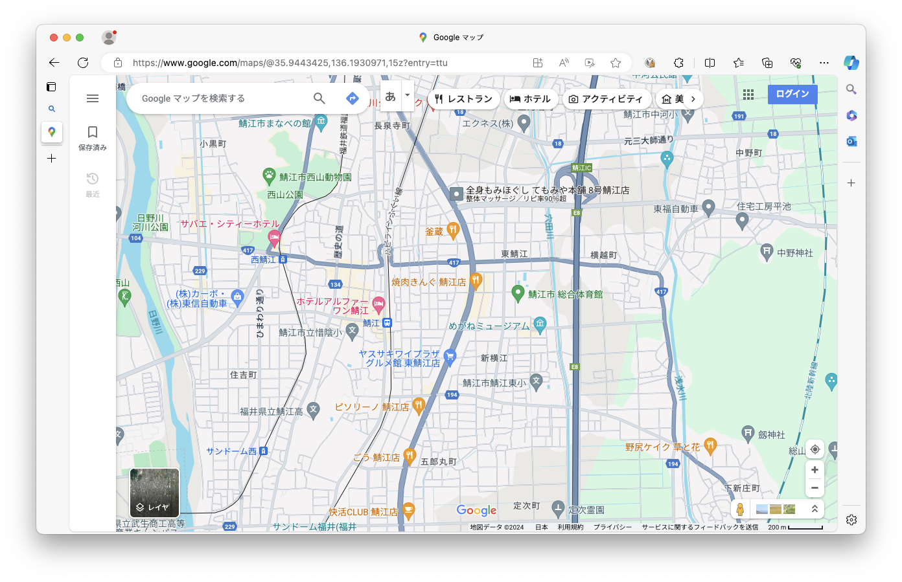
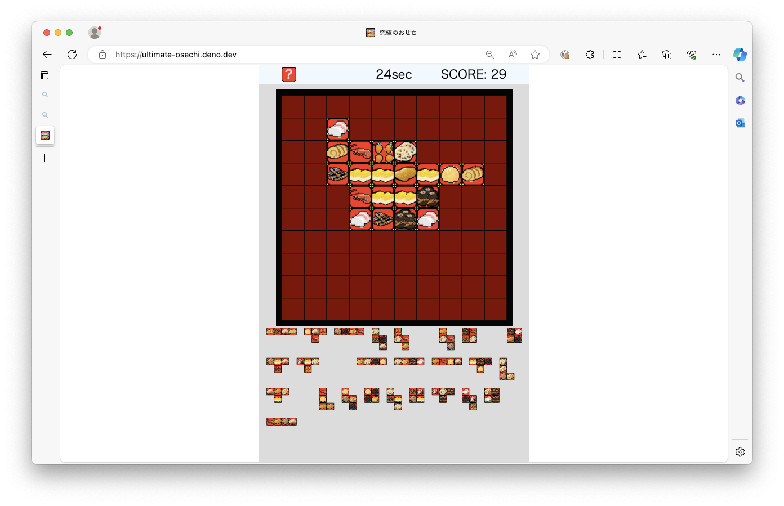
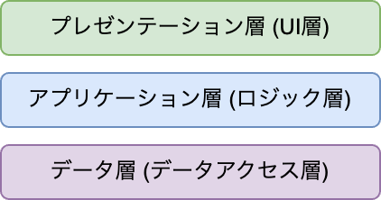
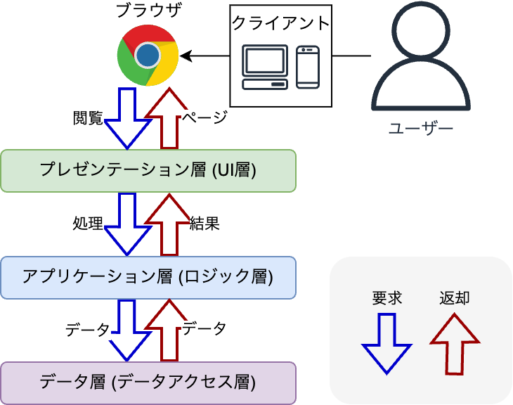
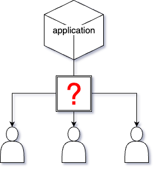
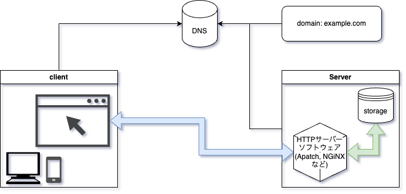
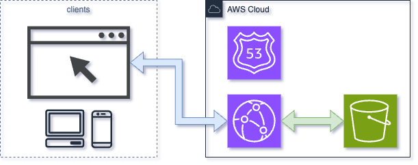
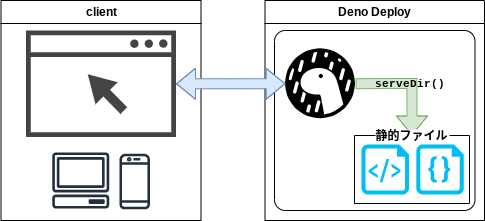

# Webアプリケーション概論

<!-- > 想定時間: 90分 -->
<!-- Author: Yamaji Toshiyuki (@haruyuki_16278) -->

---

### 目次

1. Webアプリケーションとは
2. Webアプリケーションの仕組み
    1. Webアプリケーションのシステム構成
    2. Web開発フレームワーク
    3. Webアプリケーションを公開するためには
3. 参考文献

---

## 1. Webアプリケーションとは

---

### Q. Webアプリケーションとは

---

### Q. Webアプリケーションとは

**ブラウザ上で動作するアプリケーションのこと**

---

### Q. Webアプリケーションとは

**ブラウザ上で動作するアプリケーションのこと**  

↕

**各種OS上にインストールして利用するソフトウェア**

*ネイティブアプリケーション*

---

### 例えば？

---

- 動画配信

---

- EC

---

- 地図

---

- ゲーム

---

- 表示の動的な変化を伴うホームページ

---

すべて **Webアプリケーション** といえる

---

### インターンの目標

### **Webアプリケーションを作る！**

<!-- そのためには世の中のWebアプリケーションがどのような仕組みで動作しているのかを知る必要があります。  
この講義では現代で一般的に利用されるWebアプリケーションの構成と、その中で利用されるフレームワークを中心に解説します。 -->

---

**Webアプリケーション**は**どんな仕組みで動いている**の？

---

## 2. Webアプリケーションの仕組み

- 2-1 Webアプリケーションのシステム構成
  - 2-1-1 Web開発の技術スタック
  - 2-1-2 フロントエンドとバックエンド
- 2-2 Web開発フレームワーク
  - 2-2-1 フロントエンドフレームワーク
  - 2-2-2 バックエンドフレームワーク
  - 2-2-3 フルスタックWebフレームワーク
- 2-3 Webアプリケーションを公開するためには
  - 2-3-1 コンテンツ配信とは
  - 2-3-2 コンテンツ配信の方法

---

### 2-1. Webアプリケーションのシステム構成

- 2-1-1 Web開発の技術スタック
- 2-1-2 フロントエンドとバックエンド

---

モダンなWebアプリケーションの構造
**3層クライアント・サーバーシステム**

---
<!--
3層クライアントサーバーシステムはプレゼンテーション層・アプリケーション層・データ層の3層からなるアーキテクチャ
単純なクライアントサーバーシステムからサーバーでの処理をロジックとデータ操作で分割したイメージ
-->

---
<!--
図のようなデータフローになる
-->

---

#### 2-1-1. Web開発の技術スタック

- 技術スタック
  - 開発に用いるフレームワークやツールなどの組合せのこと
    - プログラミング言語、動作環境のOS、サーバー、サーバーサイドフレームワーク、サーバーサイドライブラリ、　API、クライアントサイドフレームワーク、クライアントサイドライブラリ、クライアント、開発支援ツール、運用支援ツール、etc...

---

##### 有名な技術スタック

- LAMP/WAMP
  - Linux/Windows Server, Apache HTTP Server, MySQL, PHP
  - 比較的レガシーな構成でWeb上の情報が多い
- MEAN/MERN/MEVN
  - MongoDB, Express.js, Anguler/React/Vue, Node.js
  - サーバーとクライアントを同じ言語で開発できる

---

##### LAMPスタック→3層クライアント・サーバーシステム

| LAMPスタック | 3層C/Sシステム |
| ------ | ------ |
| Linux | - |
| Apache HTTP Server | プレゼンテーション層 |
| MySQL | データ層 |
| PHP | アプリケーション層 |

<!-- Linuxはこれらのソフトウェアが動作するインフラとなる -->

---

##### AWSを活用した技術スタックの例

**Web上に情報が多くあり利用障壁が低い**

- クライアントサイドフレームワーク
  - Angular
- クライアントサイド構成
  - Amazon CloudFront
  - Amazon S3
- サーバーサイド構成
  - Amazon API Gateway
    - AWS Lambda (Node.jsランタイム)
  - Amazon DynamoDB

---

##### Microsoft Azure を活用した技術スタックの例

**既存のMicrosoft製サービスと親和性が高い**

- フルスタックフレームワーク
  - Flask + jinja2
- サーバー
  - Azure App Service (Pythonランタイム)
  - Azure SQL Database

---

##### Deno/Deno Deployを活用した技術スタックの例

**管理するものがDeno Deployとソースのみでシンプル**

- クライアントサイド
  - HTML/CSS/JS (バニラ)
- サーバーサイドソフトウェア
  - Deno HTTP Server APIs
- サーバー
  - Deno Deploy

---

#### 2-1-2. フロントエンドとバックエンド

---

これまでに出た単語とほぼ対応する

**フロントエンド** = *クライアントサイド*
**バックエンド** = *サーバーサイド*

---

**フロントエンド**

- 役割
  - ユーザーに情報を提示する
  - ユーザーの操作を処理する
- 例) バックエンドから受け取ったデータの表示

**バックエンド**

- 役割
  - フロントエンドが要求した処理を行う
  - データの保存や取得を行う
- 例) Webページから送信されたデータの処理

---
<!-- 各種フレームワークの例をあげてみる -->
### 2-2. Web開発フレームワーク

- 2-2-1 フロントエンドフレームワーク
- 2-2-2 バックエンドフレームワーク
- 2-2-3 フルスタックWebフレームワーク

---

#### 2-2-1. フロントエンドフレームワーク

三大Webフレームワーク (JS系)

- Angular
- React
- Vue.js

他にも

- Ember
- Svelte
- Lit

---

#### 2-2-2. バックエンドフレームワーク

- Express.js (JS)
- Nest.js (JS)
- Spring Boot (Java)

---

#### 2-2-3. フルスタックWebフレームワーク

- Django (Python)
- Flask + jinja2 (Python)
- Ruby on Rails (Ruby)
- Laravel (PHP)
- Deno Fresh (JavaScript)

---

### 2-3. Webアプリケーションを公開するためには

- 2-3-1 コンテンツ配信とは
- 2-3-2 コンテンツ配信の方法

---

#### 2-3-1. コンテンツ配信とは

---

コンテンツは何らかの方法で配信され
ユーザーがアクセス可能な状態にある必要がある

- ※ コンテンツ:
　アプリケーションやWebページ、画像、動画など

---

アプリケーションをユーザーが利用するには
**ユーザーにアプリケーションを届ける仕組み**が必要

---

例えば：スマホアプリ
各種アプリストアを通してユーザーに届けられる

---

**では Webアプリケーション は？**

---

アプリケーションの実行に必要な情報を
**Webサーバーから配信する**ことでユーザーから利用可能に

---

#### 2-3-2. コンテンツ配信の方法

---

実際の構成の例：オンプレミスの場合

<!-- オンプレ構成でサーバーを公開してNGiNXなどを利用した構成 -->

---

より詳細には...

---

実際の構成の例：クラウドを利用する場合(AWS)

---

実際の構成の例：Deno Deployを利用する場合

---

## 3. まとめ

---

- Webアプリケーションとは
  - **ブラウザ上で動作するアプリケーションのこと**

- 世の中のWebアプリケーションはどんな仕組みの上で成り立っているのか
  - *3層クライアント・サーバーシステム*
  - *フロントエンドとバックエンド*
  - *フレームワーク*
  - *コンテンツ配信*

---

- **これからWebアプリケーションを作っていくために**
  - ***まずはDeno Deployで作ってみる*** ←イマココ
    - 構成がシンプル
    - コンテンツ配信やフレームワークを
      意識しなくていい

---

*インターンがおわったあと*...

- フレームワークに挑戦する
  - Deno Fresh など
- 静的サイトを作る
  - フレームワーク・コンテンツ配信
- フルスタック開発へ...

---

### ようこそ、Webアプリケーションの世界へ

---

## 4. 参考文献

- [ウェブアプリケーションとは? - ウェブアプリケーションの説明 - AWS](https://aws.amazon.com/jp/what-is/web-application/)
- [3層クライアントサーバシステムとは？概要と仕組みを理解する](https://www.learning-nao.com/?p=224)
- [クライアントサイドフレームワークの概要 - ウェブ開発を学ぶ | MDN](https://developer.mozilla.org/ja/docs/Learn/Tools_and_testing/Client-side_JavaScript_frameworks/Introduction)
- [CDNとは？コンテンツ配信の方法とCDNの仕組み｜コラム｜クラウドソリューション｜サービス｜法人のお客さま｜NTT東日本](https://business.ntt-east.co.jp/content/cloudsolution/column-66.html)

---

## 4. 参考文献

- [サーバーサイドウェブフレームワーク - ウェブ開発を学ぶ | MDN](https://developer.mozilla.org/ja/docs/Learn/Server-side/First_steps/Web_framework)
