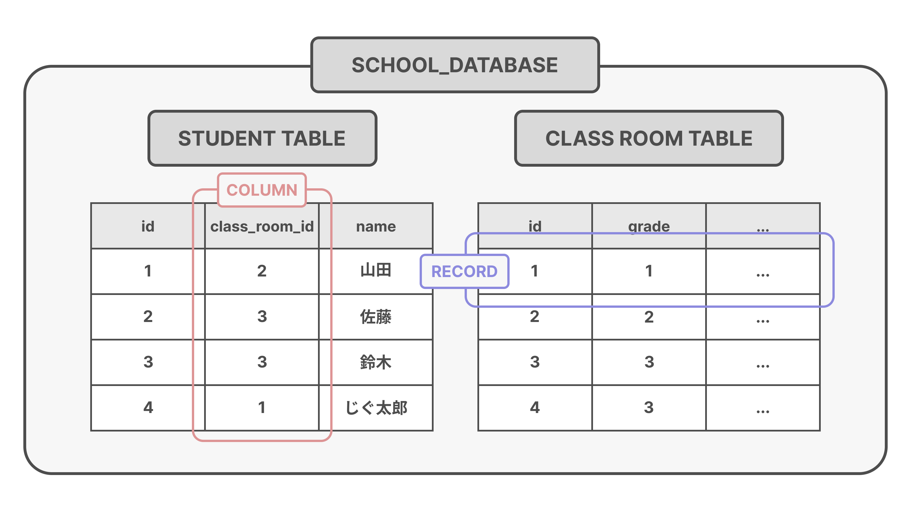
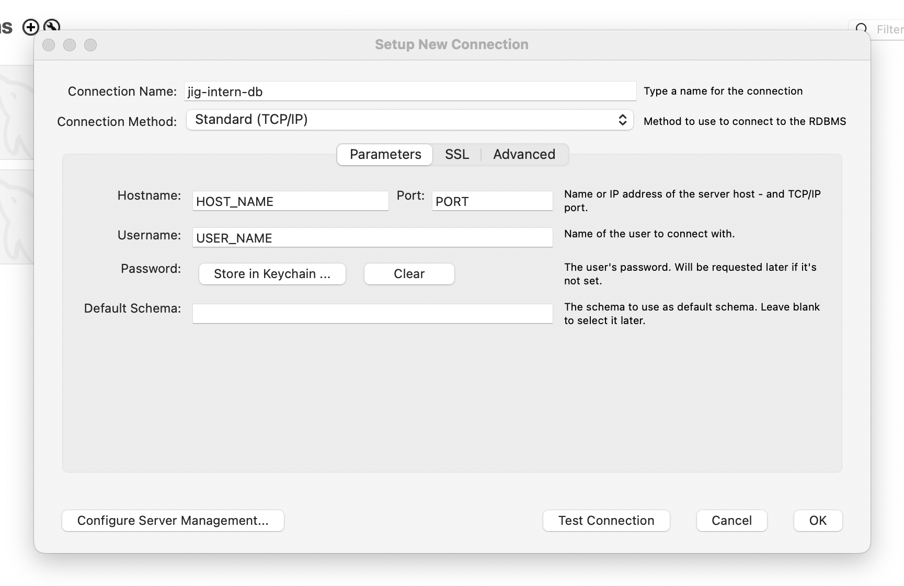
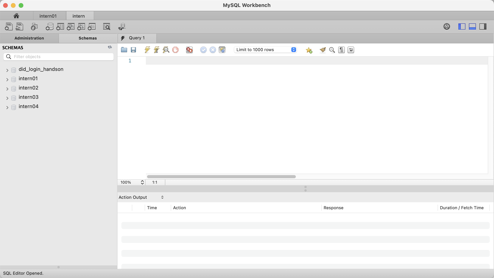

# MySQL入門

本項では、OSS（**O**pen **S**ource **S**oftware: オープンソースソフトウェア）として提供されるリレーショナル・データベース管理システム [MySQL](https://www.mysql.com/jp/) を利用した開発手法について解説します。  
簡略化のため、MySQLのセットアップ方法については解説せず、既に環境を用意しています。

また、基本的にはスライドで解説を進めるので、本項は必要に応じて参照してください。

## 1. 導入編

*データベースやMySQLについて知ろう！*

### 1-1. データベースとは何か？

> データベースとは、構造化した情報またはデータの組織的な集合であり、通常はコンピューター・システムに電子的に格納されています。
> 出典: https://www.oracle.com/jp/database/what-is-database/

データベースは、データを後続化して保存するためのシステムです。  
データの保存が必要となる多くのアプリケーションで使用されています。ファイル等に単純に保存する場合と比較してデータが扱いやすくなっています。  

その中でも、ここではリレーショナルデータベースについて解説します。

> Topic: relational／【形容詞】親類の、関係を示す、関係の、相関的な
> 出典: https://eow.alc.co.jp/search?q=relational

リレーショナル・データベースでは単純なデータ以外に、データ同士の関連情報を保存します。  
これによって、以下のような利点を得られます。

1. 整合性が保たれます。データの重複、本来存在するべきデータが削除されてしまう、等の問題を回避できます
2. データ構造の追加が容易です。新規データ構造を追加した際、既存のデータとの関連情報を追加するのみで参照等が可能になります
3. SQL言語が使用できます。SQL言語という専用の言語でデータの取得や編集を行うことができ、多くの技術者が利用できます

### 1-2. MySQLとは何か？

> MySQL（マイ・エスキューエル、海外ではマイ・シークェルとも）は、オープンソースのリレーショナルデータベース管理システム (RDBMS) である。その名前は、共同設立者のミカエル・ウィデニウスの娘の名前である「My」と、Structured Query Languageの略称である「SQL」を組み合わせたものである。
> 出典: https://ja.wikipedia.org/wiki/MySQL

MySQLは、RDBMS（**R**elational **D**ata**B**ase **M**anagement **S**ystem: 関係データベース管理システム）の一つです。  
ライセンスさえ守れば無料で利用できる上に、利用事例も多いため、インターネット上でも容易に情報を手に入れることができます。  

MySQLでは、以下のような形式でデータを保存します。  
各種用語と併せて以下に示します。

| 用語 | 意味 |
| -- | -- |
| DATABASE: データベース | 複数のTABLEを持つ。<br> 基本的にはデータ同士の関連付けはデータベースを跨がずに行う。 |
| TABLE: テーブル | 複数のRECORDを持つ。表。<br> STUDENTテーブル、CLASS_ROOMテーブル等、データの種類ごとにテーブルを分ける。 |
| COLUMN: カラム | テーブルのデータ項目。列。<br> STUDENTテーブルなら `id, class_room_id, name` などのそれぞれの項目（縦列）を指す。 |
| RECORD: レコード | テーブルに保存されるデータ。行。<br> STUDENTテーブルなら `id, class_room_id, name` などのひとかたまりのデータ（横行）を指す。 |



CLASS_ROOM - STUDENTのそれぞれのテーブルの関係を図に示すと以下のようになります。  
一つのクラスに対して複数の学生が紐付く形で、STUDENTテーブルからCLASS_ROOMを参照できるように `class_room_id` カラムにCLASS_ROOMテーブルのレコードの `id` を保存しています。

```mermaid
erDiagram
    CLASS_ROOM {
        id int
        grade int
        name char
    }
    STUDENT {
        id int
        class_room_id int
        name char
        admission_date datetime
        graduation_date datetime
    }
    CLASS_ROOM ||--o{ STUDENT : one_to_zero-or-more
```

### 1-3. MySQL　Workbenchとは何か？

> MySQL Workbench は、データベースアーキテクト、開発者、DBA のための統合ビジュアルツールです。
> 出典: https://www.mysql.com/jp/products/workbench/

MySQL WorkbenchはMySQLに対する操作を行うことができるアプリケーションです。  
SQL文に対するシンタックスハイライトや、SQL文の構築を手助けする機能が搭載されています。  
また、データベースを操作するための認証情報を記憶させることができるため、認証の簡易化等にも有効です。  

## 2. MySQLを触ってみよう

*MySQLを実際に使ってみよう！*

### 2-0. MySQLにログインしよう

今回はMySQLの環境構築等の工程はスキップし、一部データについても挿入済みのデータベースをサーバ上に予め用意しました。このデータベースにアクセスして、MySQLの操作を学習しましょう。  
データベースへのログインのための認証情報をお渡ししますので、MySQL Workbenchを起動して認証情報を入力してください。

<details>
<summary>練習: MySQL Workbenchでデータベースに接続してみよう</summary>

1. MySQL Workbenchを起動します

2. 「+」ボタンをクリックして、アクセス情報の入力ウィンドウを開きます

3. ウィンドウ上部の「Connection Name」を入力します。これはアプリ上での表示名なので、任意のもので問題ありません

> 悩むようなら `jig-intern-db` 等にしておきましょう

4. Hostname, Port, Username, Passwordを入力します。Passwordは「Store in Keychain...」から入力してください


5. ウィンドウ右下の「Test Connection」をクリックして、「Successfully made the MySQL connection」の表示を確認します

> 「Failed to Connect...」と表示されると失敗です。入力内容が正しいか、再度確認してください

6. 「OK」をクリックして設定を完了します

7. 追加されたコネクションをクリックして、データベースに接続します


</details>

### 2-1. SELECT: データを取得してみよう

| id | class_room_id | name | admission_date | graduation_date |
| -- | -- | -- | -- | -- |
| 1 | 2 | 山田 | 2022-04-01 00:00:00 | 2027-03-31 23:59:59 |
| 2 | 3 | 佐藤 | 2021-04-01 00:00:00 | 2026-03-31 23:59:59 |
| 3 | 3 | 鈴木 | 2021-04-01 00:00:00 | 2026-03-31 23:59:59 |
| 4 | 1 | じぐ太郎 | 2023-04-01 00:00:00 | 2023-03-31 23:59:59 |

`SELECT` は、レコードを取得するためのSQL文です。  
指定したテーブルからレコードを取得することができます。  
以下に基本的な取得方法等を示します。

> Topic: SQLの命令文のことを「クエリ」と呼ぶこともあります。

#### 2-1-1. レコードを全件取得する
最も基本的な `SELECT` です。データベースの中身を確認する時などに真っ先に実行することになります。  

> Topic: MySQL Workbenchでは、レコード取得時に最大取得数1000件の制限がかかるようになっています。
> 必要であれば制限を解除することもできますが、膨大なデータを取得しようとして通信が終わらなくなることがあるので、制限をかけておくことを推奨します。

<details>
<summary>練習: レコードを全件取得してみよう</summary>

0. 以降のハンズオンで使用するデータベースを使用することを宣言します。
```sql
USE mysql_handson
```

1. studentテーブルのレコードを取得してみましょう。
まずはテーブルの構成を確認します
```sql
DESC student;
```

2. レコードを全件取得してみましょう。  
以下のクエリを実行することで、studentテーブルのid, nameが取得できます。
```sql
# 任意のカラムを取得
SELECT id, name FROM student;
```

3. 全カラムを取得対象とすることもできます。  
以下のクエリを実行することで、studentテーブルの全カラム・全レコードを取得できます。
```sql
# 全カラムを取得
SELECT * FROM student;
```

4. レコードの取得時に表示順序のソートを行うことができます。  
`ORDER BY` 句を使用してみましょう。
```sql
# idで昇順ソート
SELECT * FROM student ORDER BY id ASC;

# idで降順ソート
SELECT * FROM student ORDER BY id DESC;
```

</details>


#### 2-1-2. レコードを条件付きで取得する
`WHERE` 句によって、レコードを条件付きで取得できます。  
この機能は、特定の条件のデータのみを抽出したい時などに活用されます。

> Topic: SQL文は複数行に跨って書くことも可能です。セミコロン（`;`）が命令の終了を示します。

<details>
<summary>練習: レコードを条件付きで取得してみよう</summary>

1. レコードを条件付きで取得してみましょう。  
以下のクエリを実行することで、名前が「山田」の学生のみを抽出できます。
```sql
# あるカラムが特定の値のレコードのみ取得
SELECT * FROM student WHERE name = "山田";

# -> nameが"山田"のもののみ取得
```

2. `WHERE` の後に書く内容は、条件式であれば何でも問題ありません。  
2022年以降に入学した学生のレコードを抽出してみましょう。
```sql
# あるカラムが特定の値より大きいレコードのみ取得
SELECT * FROM student WHERE admission_date >= "2022-01-01 00:00:00";

# -> idが3より大きいもののみ取得
```

3. `LIKE` 句を使用すれば、部分一致でのレコードの抽出も可能です。  
以下のクエリを実行してみましょう。
```sql
# あるカラムが特定の値と部分一致するレコードのみ取得
SELECT * FROM student WHERE name LIKE "%藤"

# -> nameが"藤"、"佐藤"、"後藤"などのレコードを取得
```

4. `IN` 句を使用すれば、リスト内の値と一致するかでレコードを抽出できます。
以下のクエリを実行してみましょう。
```sql
# あるカラムがIN以降のリストに含まれるレコードのみ取得
SELECT * FROM student WHERE name IN ("佐藤", "鈴木");

# -> nameが"佐藤"、"鈴木"の場合のみ取得
```

5. `AND` や `OR` 等で条件式を複数使用することもできます。
```sql
# 複数の条件で絞り込む
SELECT * FROM student
WHERE name IN ("佐藤", "鈴木")
AND admission_date >= "2022-01-01 00:00:00";

# -> 2022年以降に入学した、"佐藤"、"鈴木"のみを取得
```
</details>

#### 2-1-3. 集計結果の取得
集計関数を使用することで、取得結果の合計値等を求めることができます。  
集計関数には様々な種類があり、例として以下のようなものが挙げられます。

| SQL | 機能 |
| -- | -- |
| `COUNT` | レコードの件数を数える |
| `SUM` | 値の合計値を算出する |
| `AVG` | 値の平均値を算出する |
| `MAX` | 値の最大値を算出する |
| `MIN` | 値の最小値を算出する |

<details>
<summary>練習: レコードを取得した後で集計してみよう</summary>

1. exam（試験結果）のテーブルで、集計関数を使ってみましょう。  
まずはテーブルの構成を確認します。
```sql
DESC exam;
```

2. `COUNT` を使ってレコードの件数を確認しましょう。
```sql
# 取得したレコードの件数取得
SELECT COUNT(*) FROM exam;
```

2. `SUM` を使って取得したレコードの点数の合計値を確認しましょう。
```sql
# 取得した値の合計の取得
SELECT SUM(score) FROM exam;

# 絞り込んでから集計することも可能
SELECT SUM(score) FROM exam WHERE student_id = 3;
```

3. `AVG` を使って取得したレコードの点数の平均値を確認しましょう。
```sql
# 取得した値の平均値の取得
SELECT AVG(score) FROM exam;
```

4. `MAX`、`MIN` を使って取得したレコードの点数の最大値・最小値を確認しましょう。
```sql
# 最大値・最小値の取得
SELECT MAX(score) FROM exam;
SELECT MIN(score) FROM exam;
```

</details>

#### 2-1-4. 種別分けした集計結果の取得
集計関数を使用する際、集計を種別ごとに分離して行いたい場合があります。  
そんな時は、`GROUP BY` 句を使用しましょう。これによって種別ごとの集計結果を取得できます。

<details>
<summary>練習: レコードを取得した後で種別分けして集計してみよう</summary>

1. 以下のクエリで、学生ごとの平均得点を取得してみましょう。
```sql
# 学生ごとの、今までの試験の点数の平均値を取得
SELECT student_id, AVG(*) FROM exam
GROUP BY student_id;
```

</details>

#### 2-1-5. テーブルの結合とサブクエリ
関連付いたテーブル同士を結合して取得することも可能です。  
`LEFT JOIN ~ ON ~` 句を使用することで結合済みのデータを取得することができます。
また、あるクエリの結果を元に更に条件を絞り込んで取得することも可能です。この条件等の中に記載するクエリをサブクエリと呼びます。  

双方共に、複数のテーブルを参照してデータを取得することができます。  
多くの場合、テーブルの結合を使用する方が高速に処理することができますが、サブクエリを使用する方が効率的な場合や、SQL文が簡潔に書ける場合はサブクエリを使用しても問題ありません。

<details>
<summary>練習: レコードを取得した後で種別分けして集計してみよう</summary>

1. 引き続きstudentテーブル、examテーブルを使用する他、追加でclass_roomテーブルを使用します。
class_roomテーブルの構成を確認しましょう。
```sql
DESC class_room;
```

2. `LEFT JOIN ~ ON ~` を使用して、テーブルを結合して取得してみましょう。
```sql
# テーブル同士を結合して取得
SELECT * FROM student LEFT JOIN class_room
ON student.class_room_id = class_room.id;
```

3. テーブルを結合する際、`WHERE` 句を併用することで取得するレコードを絞り込むことも可能です。
```sql
# 条件付きでも取得できる
SELECT * FROM student1 LEFT JOIN student2
ON student1.student2_id = student2.id
WHERE student2.id = 100;
```

4. 次はサブクエリを使用してみます。以下のクエリでは、山田さん、鈴木さんの所属するクラスのデータを取得できます。
```sql
# サブクエリを条件に含めて検索
SELECT * FROM class_room
WHERE id IN (
    # ここがサブクエリ
    SELECT class_room_id FROM student WHERE name IN ("山田", "鈴木")
);
```

4. `GROUP BY` 句を併用して、前項「4. 種別分けした集計結果の取得」の練習で実行した内容を修正してみます。  
以下のクエリを実行することで、学生ごとの平均得点を再取得してみましょう。

```sql
SELECT student.id, student.name, SUM(exam.score) FROM exam
LEFT JOIN student ON exam.student_id = student
GROUP BY student.id;
```

</details>

### 2-2. CREATE TABLE: テーブルを作ってみよう

`CREATE TABLE` は、テーブルを新規作成するためのSQL文です。指定した定義でテーブルを作成することができます。
`CREATE TABLE` は以下のような形式で記述します。

```sql
CREATE TABLE new_table_name (
    column_name_01 column_type_01,
    column_name_02 column_type_02,
    ...
);

# 例: studentテーブルの定義
CREATE TABLE student (
    # 空欄禁止, 自動でid更新
    id int NOT NULL AUTO INCREMENT,
    class_room_id int NOT NULL,
    name varchar NOT NULL,
    addmission_date datetime NOT NULL,
    graduation_date datetime NOT NULL
);
```

<details>
<summary>練習: CREATE TABLEを用いてテーブルを新規作成してみよう</summary>

1. teacherテーブルを作成してみましょう。  
操作するテーブルの名前が重複しないように、テーブルの名前は「teacher_自分の名前」にしておいてください。
```sql
CREATE TABLE teacher_自分の名前 (
    id int NOT NULL AUTO INCREMENT,
    class_room_id int,
    name varchar NOT NULL,
    joining_date datetime NOT NULL
);

# 入力例
CREATE TABLE teacher_futaba (
    id int NOT NULL AUTO INCREMENT,  # id
    class_room_id int,               # 担任を受け持つクラスのID
    name varchar NOT NULL,           # 名前
    joining_date datetime NOT NULL   # 着任日時
);
```

2. 新規作成したテーブルの構成を確認してみましょう。
```sql
# 構成確認
DESC teacher_自分の名前;

# レコードが空になっていることを確認
SELECT * FROM teacher_自分の名前;
```

</details>


### 2-3. INSERT: データを新規作成してみよう

`INSERT` は、テーブルにレコードを追加するためのSQL文です。  
`INSERT` は以下のような形式で記述します。

```sql
INSERT INTO table_name (
    # テーブルのカラム名を羅列
    column_name_1,
    column_name_2,
    ...
) VALUES (
    # 追加するレコードのデータをカラムと同順で羅列
    column_1_value,
    column_2_value,
    ...
);
```

<details>
<summary>練習: INSERTを用いてレコードを追加してみよう</summary>

1. teacherテーブルにレコードを追加します。担任のクラスは無い想定で、class_room_idは入力しません。
また、idには`AUTO INCREMENT`を指定したので、自動で`1`が割り当てられます。
```sql
# 2023年4月に着任したじぐ先生のレコードを追加
INSERT INTO teacher_自分の名前 (
    name, joining_date
) VALUES (
    "じぐ先生", "2023-04-01 00:00:00"
);
```

2. `SELECT` で上手くレコードが追加されたか確認します
```sql
SELECT * FROM teacher_自分の名前;
```

3. 更にレコードを追加します。1年生のAクラス担任の"じぇいぴー先生"を追加してみましょう。
```sql
# 1年生のAクラスのidを確認
SELECT * FROM class_room WHERE grade = 1 AND name = "A";

# 1年生のあるクラス担任のレコードを追加する
INSERT INTO teacher_自分の名前 (
    class_room_id, name, joining_date
) VALUES (
    調べたID, "じぇいぴー先生", "2022-04-01 00:00:00"
);
```

4. `SELECT` で上手くレコードが追加されたか確認します
```sql
SELECT * FROM teacher_自分の名前;
```

</details>

### 2-4. UPDATE: データを更新してみよう

`UPDATE` は、テーブルのレコードを編集するためのSQL文です。  

`UPDATE` を行う際は、**更新対象のレコードの条件式を必ず記述**するように注意してください。  
条件式を記述せずに `UPDATE` を実行した場合、対象のテーブルの全レコードの値が書き換わってしまいます。  
バックアップがなければ修正は困難なため、細心の注意を払いましょう。

> Topic: `SELECT` で対象のレコードのidを確認して、idで条件を絞って更新するのがおすすめです。

`UPDATE` は以下のような形式で記述します。

```sql
UPDATE table_name
SET column_name_1=column_1_value, column_name_2=column_2_value, ...
WHERE 条件式;
```

<details>
<summary>練習: UPDATEを用いてレコードを編集してみよう</summary>

1. 担任を持っていなかったじぐ先生が、1年生のBクラスの担任になることになりました。対象のレコードにclass_room_idを割り当ててみましょう。
```sql
# 1年生のBクラスのidを確認
SELECT * FROM class_room WHERE grade = 1 AND name = "B";

# じぐ先生のidを確認
SELECT * FROM teacher_自分の名前 WHERE name = "じぐ先生";

# じぐ先生を1年生のBクラスの担任に割当
UPDATE teacher_自分の名前
SET class_room_id = 1年生のBクラスのid
WHERE id = じぐ先生のid
```

2. `SELECT` で上手くレコードが編集されたか確認します
```sql
SELECT * FROM teacher_自分の名前;
```

</details>

### 2-5. DELETE: データを削除してみよう

`DELETE` は、テーブルのレコードを削除するためのSQL文です。  

`DELETE` を行う際は、**削除対象のレコードの条件式を必ず記述**するように注意してください。  
条件式を記述せずに `DELETE` を実行した場合、対象のテーブルの全レコードが削除されます。 
バックアップがなければ修正は困難なため、細心の注意を払いましょう。

> Topic: `SELECT` で対象のレコードのidを確認して、idで条件を絞って削除するのがおすすめです。

`DELETE` は以下のような形式で記述します。

```sql
DELETE FROM table_name
WHERE 条件式;
```

<details>
<summary>練習: DELETEを用いてレコードを編集してみよう</summary>

1. じぇいぴー先生が、教職を引退することになりました。対象のレコードを削除しましょう。
```sql
# じぇいぴー先生のidを確認
SELECT * FROM teacher_自分の名前 WHERE name = "じぇいぴー先生";

# じぇいぴー先生を削除
DELETE FROM teacher_自分の名前 WHERE id = じぇいぴー先生のid;
```

2. `SELECT` で上手くレコードが削除されたか確認します
```sql
SELECT * FROM teacher_自分の名前;
```

</details>

### 2-6. ALTER TABLE: テーブルの定義を修正する

`ALTER TABLE` は、テーブルの定義を書き換えるためのSQL文です。  
`CREATE TABLE` 時に指定した定義を後から書き換えることができます。

> Topic: 既にテーブルの中にレコードが保存されている場合、テーブルの定義変更によって保存されている値が不適切なものにならないか、よく確認する必要があります。

`ALTER TABLE` は以下のような形式で記述します。

```sql
# テーブル名の変更
ALTER TABLE before_table_name
RENAME TO after_table_name;

# テーブルのカラム名の変更
ALTER TABLE table_name
RENAME COLUMN before_column_name TO after_column_name;

# カラム定義変更
ALTER TABLE table_name
MODIFY COLUMN column_name new_data_type 制約;

# カラム追加
ALTER TABLE table_name
ADD COLUMN new_column_name column_type 制約;

# カラム削除
ALTER TABLE table_name
DROP COLUMN column_name;
```

<details>
<summary>練習: ALTER TABLEを用いて、よく使用するテーブルの定義変更を行ってみよう</summary>

1. teacherテーブルに登録されるレコード数が将来的にintの上限である2^31-1を超えることを考慮して、型をbigint型に変更してみましょう。bigintの上限は2^63-1です。

> Topic: 新任の先生が一年に3人増えたとして、約715827882年でintの上限に到達します。

```sql
# 定義を変更
ALTER TABLE teacher_自分の名前
MODIFY COLUMN id bigint NOT NULL AUTO INCREMENT;

# 定義を確認
DESC teacher_自分の名前;
```

2. teacherテーブルに、性別の記録用のgenderカラムを追加します。
```sql
# カラムを追加
ALTER TABLE teacher_自分の名前
ADD COLUMN gender varchar;

# 定義を確認
DESC teacher_自分の名前;
SELECT * FROM teacher_自分の名前;
```
</details>