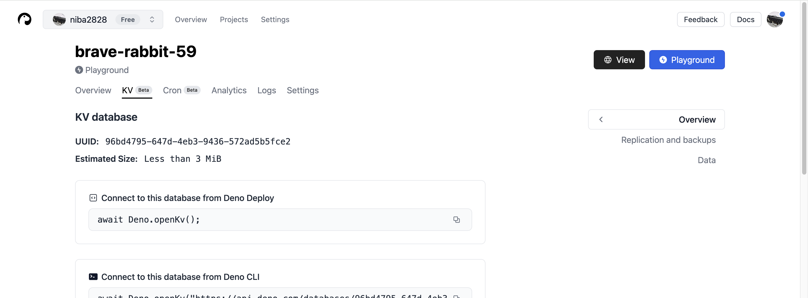

# Deno KV入門

本項では、Deno Land Inc.から提供されているDeno用データベース [Deno KV](https://deno.com/kv) を利用した開発手法について解説します。  
データの保存が可能になれば、アプリケーション開発の幅が一気に広がります！

## 1. 導入編

*データベースやDeno KVについて知ろう！*

### 1-1. データベースとは何か？

> データベースとは、構造化した情報またはデータの組織的な集合であり、通常はコンピューター・システムに電子的に格納されています。  
> 出典: https://www.oracle.com/jp/database/what-is-database/

データベースは、データを構造化して保存するためのシステムです。  
データの保存が必要となる多くのアプリケーションで使用されています。ファイル等に単純に保存する場合と比較してデータが扱いやすくなっています。

データベースを操作するための方式は大きく分けると、「RDBMS」と「NoSQL」の二種類に分けられます。

「RDBMS: **R**elational **D**ata**B**ase **M**anagement **S**ystem」では、データを表に保存し、表同士を関連付けることでデータを保存します。また、データベースを操作する言語であるSQLを使用できるようになっています。  
MySQLやPostgreSQLなどが代表的です。

「NoSQL: **N**ot **o**nly **SQL**」は、「RDBMS」以外の総称です。名前の通り、SQLを使用しないことが特徴です。SQLが得意とする機能が利用できない代わりに、大規模な並列分散処理や、柔軟なデータ構造を実装できます。様々な種類が存在しており、目的ごとに独自の機能を持っています。  
MongoDBやDynamoDB、Cloud Firestoreなどが代表的です。

> Topic: NoSQLにはkeyとvalueのペアで値を保持する「key-valueデータベース」、JSON形式でデータ保存する「ドキュメントデータベース」、グラフ構造を備える「グラフデータベース」などが存在します。詳細な解説は省きますが、興味のある方は調べてみて下さい。

本項で学習するDeno KVは、NoSQLのkey-valueデータベースに分類されます。  
キーに対してバリューを1つ保存する、シンプルな構造のデータベースです。

### 1-2. Deno KVとは何か？

Deno KVは、Deno Land Inc.から提供されているDeno用NoSQLデータベースです。key-valueデータベースに分類されます。Deno公式から提供されていることもあり、Denoから比較的容易に利用できます。β版なので機能は限定的ですが、個人開発程度であれば、十分な性能を発揮してくれるでしょう。

Deno KVでは、以下のような形式でデータを保存します。ここでは、学校の名簿を想定して例を記載しています。  
keyに対してvalueが一意に紐づくため、keyとvalueのデータ構造は慎重に決定しましょう。

> Tips: Deno KVのkeyには、JSON等と異なり、複数の要素をリスト形式で当てることができます。

| key | value |
| -- | -- |
| `["school", "classroom", 1]` | `{ "grade": 1, "class": "A" }` |
| `["school", "classroom", 2]` | `{ "grade": 1, "class": "B" }` |
| `["school", "classroom", 3]` | `{ "grade": 2, "class": "A" }` |
| `["school", "student", 1]` | `{ "name": "田中", "classroom": 1 }` |
| `["school", "student", 2]` | `{ "name": "山田", "classroom": 2 }` |
| `["school", "student", 3]` | `{ "name": "じぐ太郎", "classroom": 2 }` |

## 2. 実践編

*Deno KVを実際に使ってみよう！*

### 2-0. Deno Deployで新規Playgroundを作成しよう

Deno Deployには、Denoのコードを簡単に記述・実行・デプロイできるPlaygroundという機能が搭載されています。ここでは、簡単のためPlaygroundを使用してみましょう。

> Topic: ローカルでDeno KVを利用する場合、Denoの起動時のオプションに`--unstable`が必要になります
> ```sh
> # 例
> deno run -A --unstable my_kv_code.ts
> ```

<details>
<summary>練習: DenoのPlaygroundを作ってみよう</summary>

1. [Deno Deploy](https://deno.com/deploy)にログインします

2. ページ右側の「New Playground」をクリックします


3. 以下のような画面が開けばOKです


4. 画面左側のコードを以下のように書き換えて、「Media Type」をTSからJSに変更して、「Save & Deploy」をクリックします

```js
Deno.serve(async(req) => {
    return new Response("Hello Deno");
});
```

5. 画面右側のブラウザが書き換わればOKです

6. [Deno Deployのホーム画面](https://dash.deno.com/account/overview)を開き、作成したアプリケーションを開きます

7. 以下のような画面が開けばOKです。この画面を（ここでは便宜上）Project画面と呼びます


</details>

### 2-1. set: Deno KVにデータを保存する

Deno KVにデータを保存してみましょう。以下のようなコードを書くことで、簡単にDeno KVにアクセスして、データを保存できます。

```js
// Deno KVにアクセス
const kv = await Deno.openKV();

// Deno KVに保存
// 第一引数はkey, 第二引数はvalue
// keyが既に存在する場合は、更新
const result = await kv.set(["hoge"], { "fuga": "waiwai" });

// レスポンスを表示
console.log(result);
```

<details>
<summary>練習: Deno KVにアクセスしてみよう</summary>

1. Deno KVにアクセスするコードを書き加えます

```diff
Deno.serve(async(req) => {
+   const kv = await Deno.openKv();
+   console.log(kv);

    return new Response("Hello Deno");
});
```

2. 「Save & Deploy」をクリックして、ログに「Kv {}」と表示されていることを確認します

</details>

<details>
<summary>練習: Deno KVにデータを追加してみよう</summary>

1. Deno KVにデータを保存するコードを書き加えます。ここでは、簡単のためkeyは固定しておきます

```diff
Deno.serve(async(req) => {
    const kv = await Deno.openKv();
    console.log(kv);

+   const key = ["student", 1];
+   const value = {
+       name: "山田"
+   };
+   const result = await kv.set(key, value);
+   console.log(result);

    return new Response("Hello Deno");
});
```

2. 「Save & Deploy」をクリックして、ログに保存ログが表示されていることを確認します

3. Deno DeployのProject画面から、Deno KVに保存された値を確認します

4. 以下のようになっていたらOKです



</details>

<details>
<summary>練習: Deno KVのデータを更新してみよう</summary>

1. Deno KVのデータを更新するようにコードを書き換えます。先程書き込んだkeyを指定して更新します

```diff
Deno.serve(async(req) => {
    const kv = await Deno.openKv();
    console.log(kv);

    const key = ["student", 1];
    const value = {
-       name: "山田"
+       name: "高橋"
    };
    const result = await kv.set(key, value);
    console.log(result);

    return new Response("Hello Deno");
});
```

2. 「Save & Deploy」をクリックして、ログに保存ログが表示されていることを確認します

3. Deno DeployのProject画面から、Deno KVの更新された値を確認します

</details>

<details>
<summary>練習: Deno KVに更にデータを追加してみよう</summary>

1. 後のために、Deno KVに更にデータを追加しておきます

```diff
Deno.serve(async(req) => {
    const kv = await Deno.openKv();
    console.log(kv);

    const key = ["student", 1];
    const value = {
        name: "高橋"
    };
    const result = await kv.set(key, value);
    console.log(result);
+
+   await kv.set(["student", 2], { name: "佐藤" });
+   await kv.set(["student", 3], { name: "鈴木" });
+   await kv.set(["student", 4], { name: "じぐ太郎" });
+   await kv.set(["teacher", 1], { name: "じぐ先生" });
+   await kv.set(["teacher", 2], { name: "じぇいぴー先生" });

    return new Response("Hello Deno");
});
```

2. 「Save & Deploy」をクリックして、ログに保存ログが表示されていることを確認します

3. Deno DeployのProject画面から、Deno KVの更新された値を確認します

</details>

### 2-2. get/getMany/list: Deno KVからデータを取得してみよう

Deno KVからデータを取得してみましょう。データの取得には幾つかの方法があります。

- get: 単体の取得
- getMany: 複数の取得
- list: 条件指定の取得

この3種類を上手く活用して、データを取得してください。

```js
// Deno KVにアクセス
const kv = await Deno.openKV();

// get: 単体の取得
const getResult = await kv.get(["hoge", 1]);
console.log(getResult);

// getMany: 複数の取得
const getManyResult = await kv.getMany([
    ["hoge", 1],
    ["hoge", 2],
    ["fuga", 1]
]);
console.log(getManyResult);

// list: 条件指定の取得
const listResult = await kv.list({ prefix: ["hoge"] })
for await (const item of listResult) {
    console.log(item);
}
```

<details>
<summary>練習: Deno KVのデータを単体取得してみよう</summary>

1. `get`では、取得したいkeyだけを指定します。ここでは、`key: ["student", 1]`のデータを取得してみましょう

```diff
Deno.serve(async(req) => {
    const kv = await Deno.openKv();
    console.log(kv);

    // ...
    await kv.set(["teacher", 2], { name: "じぇいぴー先生" });
+
+   const getResult = await kv.get(["student", 1]);
+   console.log("get_result: ", getResult);

    return new Response("Hello Deno");
});
```

2. 「Save & Deploy」をクリックして、ログに取得された値が出力されるのを確認します

</details>

<details>
<summary>練習: Deno KVのデータを複数取得してみよう</summary>

1. `getMany`では、取得したいkeyを全て指定します。ここでは、`key: ["student", 1]~["student", 4]`のデータを取得してみましょう

```diff
Deno.serve(async(req) => {
    const kv = await Deno.openKv();
    console.log(kv);

    // ...
    console.log("get_result: ", getResult);
+
+   const getManyResult = await kv.getMany([
+       ["student", 1],
+       ["student", 2],
+       ["student", 3],
+       ["student", 4],
+   ]);
+   console.log("get_many_result: ", getManyResult);

    return new Response("Hello Deno");
});
```

2. 「Save & Deploy」をクリックして、ログに取得された値が出力されるのを確認します

</details>

<details>
<summary>練習: Deno KVのデータを条件指定で取得してみよう</summary>

1. `list`では、取得したいkeyの条件を指定します。ここでは、`prefix`を使用して`"teacher"`のデータを全て取得してみましょう

```diff
Deno.serve(async(req) => {
    const kv = await Deno.openKv();
    console.log(kv);

    // ...
    console.log("get_many_result: ", getManyResult);
+
+   // イテレーターが作成される
+   const teacherIterator = kv.list({
+       prefix: ["teacher"],
+   });
+   // ループしながらDeno KVに問い合わせるので、forループにawaitを付ける
+   for await (const teacherItem of teacherIterator) {
+       console.log("teacher_item: ", teacherItem);
+   }

    return new Response("Hello Deno");
});
```

2. 「Save & Deploy」をクリックして、ログに取得された値が出力されるのを確認します

3. `list`では、範囲指定のデータを取得することもできます。`key: ["student", 1]~["student", 2]`のデータを取得してみましょう

```diff
Deno.serve(async(req) => {
    const kv = await Deno.openKv();
    console.log(kv);

    // ...
        console.log("teacher_item: ", teacherItem);
    }
+
+   // start以上end未満の値が検索対象になるので、["student", 1] ~ ["student", 2]を取得したい場合、endには["student", 3]を指定する
+   // `start` <= 検索対象 < `end`
+   const studentIterator = kv.list({
+       start: ["student", 1],
+       end: ["student", 3],
+   });
+   for await (const studentItem of studentIterator) {
+       console.log("student_item: ", studentItem);
+   }

    return new Response("Hello Deno");
});
```

4. 「Save & Deploy」をクリックして、ログに取得された値が出力されるのを確認します

</details>

### 2-3. delete: Deno KVからデータを削除してみよう

Deno KVに保存したデータを削除してみましょう。データの削除には`delete`を使用します。

```js
// Deno KVにアクセス
const kv = await Deno.openKV();

// データを削除
const result = await kv.delete(["hoge"]);

// レスポンスを表示
console.log(result);
```

<details>
<summary>練習: Deno KVからデータを削除してみよう</summary>

1. Deno KVのデータを削除するコードを書き加えます。`key: ["student", 1]`を削除してみましょう

```diff
Deno.serve(async(req) => {
    const kv = await Deno.openKv();
    console.log(kv);

    // ...
       console.log("student_item: ", studentItem);
    }
+
+   // データを削除
+   await kv.delete(["student", 1]);

    return new Response("Hello Deno");
});
```

2. 「Save & Deploy」をクリックします

3. Deno DeployのProject画面から、Deno KVの値が削除されていることを確認します

</details>

<!--
## 3. 補足編

*Deno KVのデータを、管理画面から見てみよう！*
-->