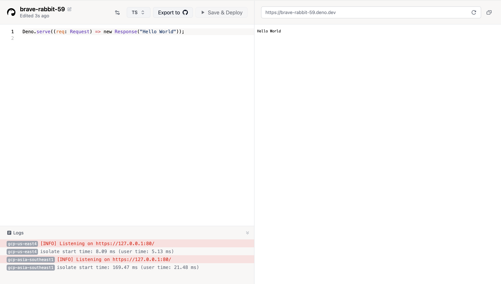

# Deno KV入門

本項では、Deno Land Inc.から提供されているDeno用データベース [Deno KV](https://deno.com/kv) を利用した開発手法について解説します。  
データの保存が可能になれば、アプリケーション開発の幅が一気に広がります！

## 1. 導入編

*データベースやDeno KVについて知ろう！*

### 1-1. データベースとは何か？

> データベースとは、構造化した情報またはデータの組織的な集合であり、通常はコンピューター・システムに電子的に格納されています。  
> 出典: https://www.oracle.com/jp/database/what-is-database/

データベースは、データを構造化して保存するためのシステムです。  
データの保存が必要となる多くのアプリケーションで使用されています。ファイル等に単純に保存する場合と比較してデータが扱いやすくなっています。

データベースを操作するための方式は大きく分けると、「RDBMS」と「NoSQL」の二種類に分けられます。

「RDBMS: **R**elational **D**ata**B**ase **M**anagement **S**ystem」では、データを表に保存し、表同士を関連付けることでデータを保存します。また、データベースを操作する言語であるSQLを使用できるようになっています。  
MySQLやPostgreSQLなどが代表的です。

「NoSQL: **N**ot **o**nly **SQL**」は、「RDBMS」以外の総称です。名前の通り、SQLを使用しないことが特徴です。SQLが得意とする機能が利用できない代わりに、大規模な並列分散処理や、柔軟なデータ構造を実装できます。様々な種類が存在しており、目的ごとに独自の機能を持っています。  
MongoDBやDynamoDB、Cloud Firestoreなどが代表的です。

本項で学習するDeno KVは、NoSQLのkey-valueデータベースに分類されます。  
キーに対してバリューを1つ保存する、シンプルな構造のデータベースです。

### 1-2. Deno KVとは何か？

Deno KVは、Deno Land Inc.から提供されているDeno用NoSQLデータベースです。key-valueデータベースに分類されます。Deno公式から提供されていることもあり、Denoから比較的容易に利用できます。β版なので機能は限定的ですが、個人開発程度であれば、十分な性能を発揮してくれるでしょう。

Deno KVでは、以下のような形式でデータを保存します。ここでは、簡単なTODOアプリを想定して表を記載しています。  
keyに対してvalueが一意に紐づくため、keyとvalueのデータ構造は慎重に決定しましょう。

| key | value |
| -- | -- |
| `["tasks", "user", 1, 1]` | `{ "title": "課題資料を作成する", "description": "2024年の夏季インターンシップ用の資料を作成する", "deadline": "2024-04-30 23:59:59" }` |
| `["tasks", "user", 1, 2]` | `{ "title": "Deno KVの勉強会資料を作成する", "description": "Deno KVの資料を作成する", "deadline": "2024-06-13 23:59:59" }` |
| `["tasks", "user", 2, 1]` | `{ "title": "デザイン概論の勉強会資料を作成する", "description": "デザイン概論の資料を作成する", "deadline": "2024-06-13 23:59:59" }` |
| `["users", 1]` | `{ "name": "futaba", "icon_url": "https://.../futaba.jpg" }` |
| `["users", 2]` | `{ "name": "hayasaka", "icon_url": "https://.../hayasaka.jpg" }` |

## 2. 実践編

*Deno KVを実際に使ってみよう！*

### 2-0. Deno Deployで新規Playgroundを作成しよう

Deno Deployには、Denoのコードを簡単に記述・実行・デプロイできるPlaygroundという機能が搭載されています。ここでは、簡単のためPlaygroundを使用してみましょう。

> Topic: ローカルでDeno KVを利用する場合、`--unstable`オプションが必要になります
> ```sh
> # 例
> deno run -A --unstable my_kv_code.ts
> ```

<details>
<summary>練習: DenoのPlaygroundを作ってみよう</summary>

1. [Deno Deploy](https://deno.com/deploy)にログインします

2. ページ右側の「New Playground」をクリックします


3. 以下のような画面が開けばOKです


4. 画面左側のコードを以下のように書き換えて、「Media Type」をTSからJSに変更して、「Save & Deploy」をクリックします

```js
Deno.serve(async(req) => {
    return new Response("Hello Deno");
});
```

5. 画面右側のブラウザが書き換わればOKです

6. [Deno Deployのホーム画面](https://dash.deno.com/account/overview)を開き、作成したアプリケーションを開きます

7. 以下のような画面が開けばOKです。この画面をProject画面と呼びます


</details>

### 2-1. set: Deno KVにデータを保存する

Deno KVにデータを保存してみましょう。以下のようなコードを書くことで、簡単にDeno KVにアクセスして、データを保存できます。

```js
// Deno KVにアクセス
const kv = await Deno.openKV();

// Deno KVに保存
// 第一引数はkey, 第二引数はvalue
const result = await kv.set(["hoge"], { "fuga": "waiwai" });

// レスポンスを表示
console.log(result);
```

<details>
<summary>練習: Deno KVにアクセスしてみよう</summary>

1. Deno KVにアクセスするコードを書き加えます

```diff
Deno.serve(async(req) => {
+   const kv = await Deno.openKv();
+   console.log(kv);

    return new Response("Hello Deno");
});
```

2. 「Save & Deploy」をクリックして、ログに「Kv {}」と表示されていることを確認する

</details>

<details>
<summary>練習: Deno KVにデータを追加してみよう</summary>

1. Deno KVにデータを保存するコードを書き加えます。ここでは、簡単のためkeyは固定しておきます

```diff
Deno.serve(async(req) => {
    const kv = await Deno.openKv();
    console.log(kv);

+   const key = ["shiritori", 1];
+   const value = {
+       word: "しりとり"
+   };
+   const result = await kv.set(key, value);
+   console.log(result);

    return new Response("Hello Deno");
});
```

2. 「Save & Deploy」をクリックして、ログに保存ログが表示されていることを確認する

3. Deno DeployのProject画面から、Deno KVに保存された値を確認します

4. 以下のようになっていたらOKです


</details>

<details>
<summary>練習: Deno KVのデータを更新してみよう</summary>

1. Deno KVのデータを更新するようにコードを書き換えます。先程書き込んだkeyを指定して更新します

```diff
Deno.serve(async(req) => {
    const kv = await Deno.openKv();
    console.log(kv);

    const key = ["shiritori", 1];
    const value = {
-       word: "しりとり"
+       word: "りんご"
    };
    const result = await kv.set(key, value);
    console.log(result);

    return new Response("Hello Deno");
});
```

2. 「Save & Deploy」をクリックして、ログに保存ログが表示されていることを確認する

3. Deno DeployのProject画面から、Deno KVの更新された値を確認します

</details>


## 3. 補足編

*Deno KVのデータを、管理画面から見てみよう！*