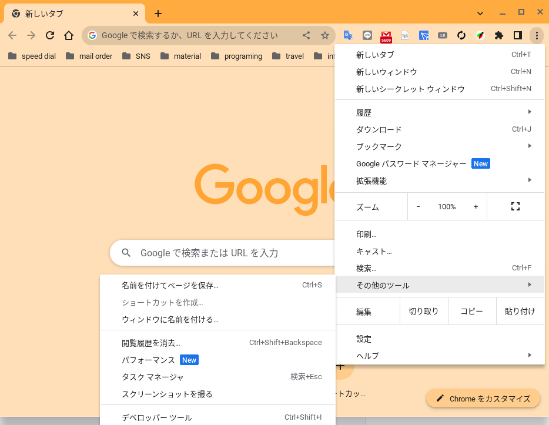
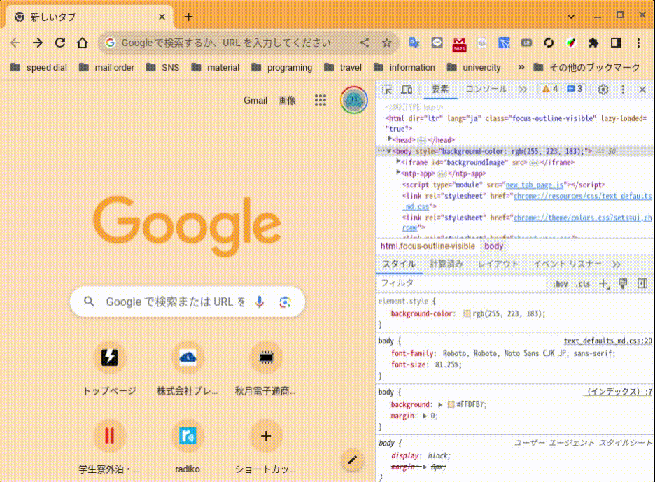

# HTML/CSS を始めよう

> 想定時間: 90分
> 動作環境: Google Chrome / [StackBlitz](https://stackblitz.com)

  
TOC

- HTML/CSS を始めよう
   1. HTML/CSSに触れてみよう
      1. 開発者ツールを見よう
         1. Elements(要素)タブを見よう
         2. Style(スタイル)タブを見よう
         3. Computed(計算済み)タブを見よう
         4. VisBugを使ってみよう
      2. Hello, World! しよう
   2. ページを作ってみよう
      1. HTMLを知ろう
      2. `<head>`タグの中に書くことを知ろう
      3. 
   3. レイアウトを考えよう
      1. CSSについて知ろう
      2. 
   4. 動的にページに変更を加えよう
      1. JSを組み込もう

## 1. HTML/CSSに触れてみよう

Web開発をやってみようと思ったとき、誰しもがまず目にするのが `HTML`/`CSS`/`JavaScript` という組み合わせだと思います。これらについていまから学んでいきます。

### 1-1. 開発者ツールを見よう

まずWeb開発で必ず使うツールとしてブラウザの開発者ツールの使い方を説明します。
ブラウザの右上のケバブボタンからメニューを開いて、「その他のツール」→「デベロッパーツール」から開発者ツールを開いておいてください。

#### 1-1-1. Elements(要素)タブを見よう

↑で開いてもらった開発者ツールの一番上のタブで「Elememts」もしくは「要素」と書かれているタブがあるのでそこを開いてください。

ここで開発者ツールの左上にある点線と矢印のアイコンをクリックすると、ページの要素をクリックしてツールで要素の詳細を確認できます。

#### 1-1-2. Style(スタイル)タブを見よう

1-1-1. でやったようにして要素選択ツールなどで適当な要素を選択すると、それに合わせて開発ツール下部にあるスタイルタブ内の表示も変わります。ここでは各セレクタに適用されているスタイルを確認することができます。
また、ここで適当にスタイルを書き換えることもできます。

#### 1-1-3. Computed(計算済み)タブを見よう

1-1-2. で確認したStyleタブの横に Computed(計算済み)タブ があるので、そこも確認しましょう。

このタブでは選択中の要素の計算された大きさが表示されます。
外から順にmargin、border、padding、content(内容)の大きさがそれぞれでわかるため意図しない大きさが設定されている部分などを見つけやすいです。

#### 1-1-4. VisBugを使ってみよう

ここでChromeで使える便利な拡張機能「VisBug」も紹介します。[こちら](https://chrome.google.com/webstore/detail/visbug/cdockenadnadldjbbgcallicgledbeoc?hl=ja)からインストールできます。

インストールしたら `Alt`+`Shift`+`D` のショートカットでVisBugを起動できます。
様々な機能がありますが、特に便利なガイドツールとインスペクトツールを紹介しておきます。

VisBug の起動時に自動で開くツールがガイドツールです。このツールでは、クリックした要素とマウスホバー中の要素の大きさの差分が表示されます。

標準だと左側に出てくるツールバーから二番目のツールを開くとインスペクトツールになります。
このツールはホバー中の要素の詳細が簡単に見れるツールで、devtoolのComputedタブで見ていた要素の大きさだったり、Styleタブで確認した色周りの設定も一発で見れるのが便利です。

ここで紹介した開発者ツールと拡張機能は何かと使えると便利なので頭の片隅にでもおいておいてください。

## 2. ページを作ってみよう

## 3. レイアウトを考えよう

## 4. 動的にページに変更を加えよう
