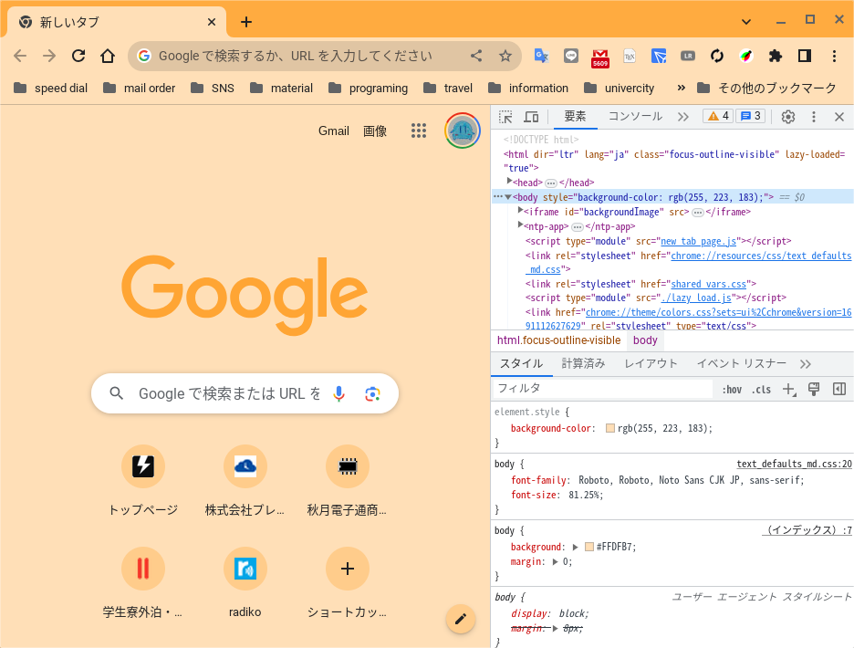
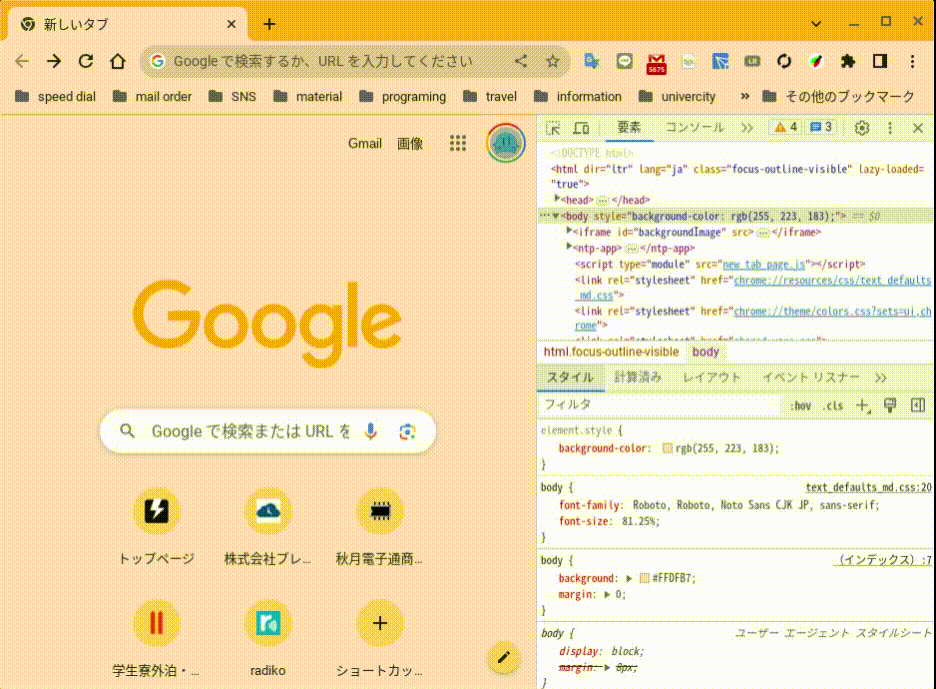
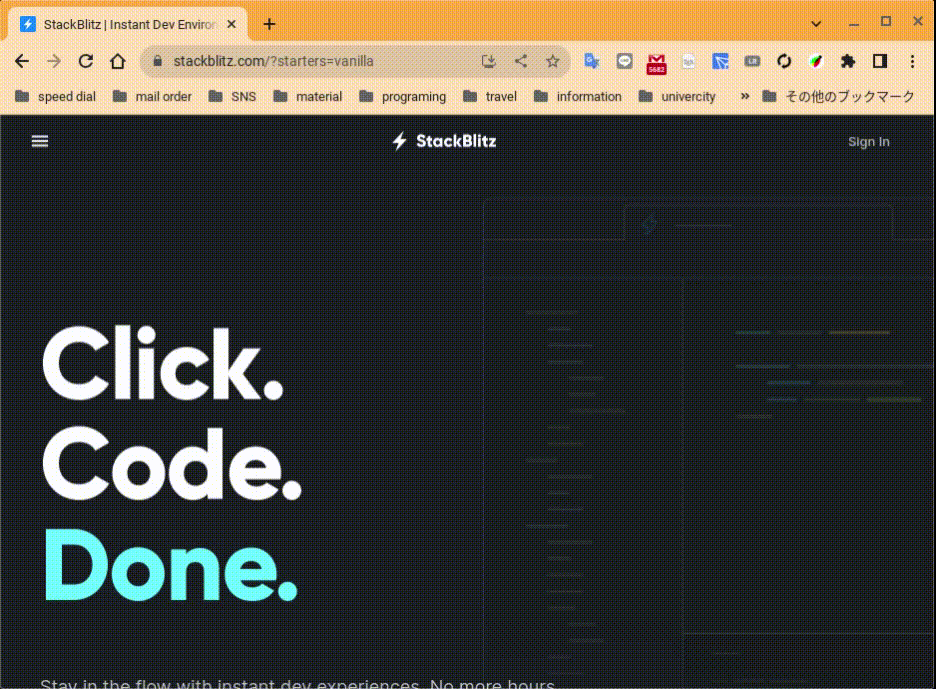
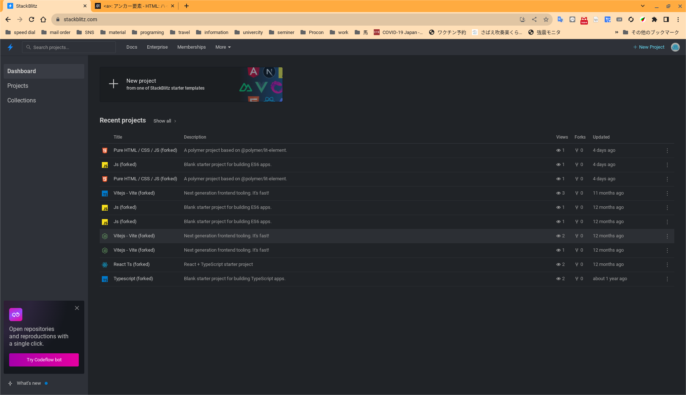
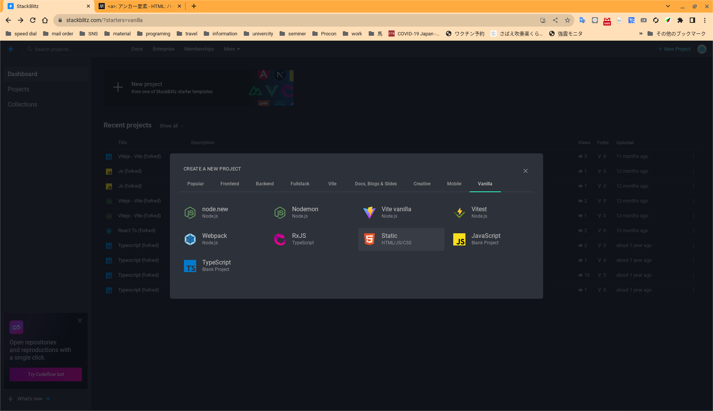
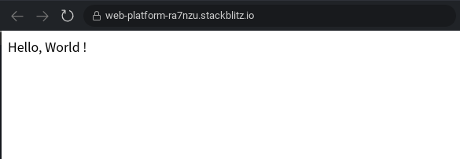

# HTML/CSS を始めよう

> 想定時間: 90分
> 動作環境: Google Chrome / [StackBlitz](https://stackblitz.com)

<details>
  <summary>TOC</summary>

- HTML/CSS を始めよう
   1. HTML/CSSに触れてみよう
      1. 開発者ツールを見よう
         1. Elements(要素)タブを見よう
         2. Style(スタイル)タブを見よう
         3. Computed(計算済み)タブを見よう
         4. VisBugを使ってみよう
      2. Hello, World! しよう
   2. ページを作ってみよう
      1. 
   3. レイアウトを考えよう
      1. CSSについて知ろう
      2. 
   4. 動的にページに変更を加えよう
      1. JSを組み込もう

</details>

## 1. HTML/CSSに触れてみよう

Web開発をやってみようと思ったとき、誰しもがまず目にするのが `HTML`/`CSS`/`JavaScript` という組み合わせだと思います。これらについていまから学んでいきます。

### 1-1. 開発者ツールを見よう

まずWeb開発で必ず使うツールとしてブラウザの開発者ツールの使い方を説明します。
ブラウザの右上のケバブボタンからメニューを開いて、「その他のツール」→「デベロッパーツール」から開発者ツールを開いておいてください。


#### 1-1-1. Elements(要素)タブを見よう

↑で開いてもらった開発者ツールの一番上のタブで「Elememts」もしくは「要素」と書かれているタブがあるのでそこを開いてください。



ここで開発者ツールの左上にある点線と矢印のアイコンをクリックすると、ページの要素をクリックしてツールで要素の詳細を確認できます。


#### 1-1-2. Style(スタイル)タブを見よう

1-1-1. でやったようにして要素選択ツールなどで適当な要素を選択すると、それに合わせて開発ツール下部にあるスタイルタブ内の表示も変わります。ここでは各セレクタに適用されているスタイルを確認することができます。
また、ここで適当にスタイルを書き換えることもできます。


#### 1-1-3. Computed(計算済み)タブを見よう

1-1-2. で確認したStyleタブの横に Computed(計算済み)タブ があるので、そこも確認しましょう。



このタブでは選択中の要素の計算された大きさが表示されます。
外から順にmargin、border、padding、content(内容)の大きさがそれぞれでわかるため意図しない大きさが設定されている部分などを見つけやすいです。

#### 1-1-4. VisBugを使ってみよう

ここでChromeで使える便利な拡張機能「VisBug」も紹介します。[こちら](https://chrome.google.com/webstore/detail/visbug/cdockenadnadldjbbgcallicgledbeoc?hl=ja)からインストールできます。

インストールしたら `Alt`+`Shift`+`D` のショートカットでVisBugを起動できます。
様々な機能がありますが、特に便利なガイドツールとインスペクトツールを紹介しておきます。

VisBug の起動時に自動で開くツールがガイドツールです。このツールでは、クリックした要素とマウスホバー中の要素の大きさの差分が表示されます。



標準だと左側に出てくるツールバーから二番目のツールを開くとインスペクトツールになります。
このツールはホバー中の要素の詳細が簡単に見れるツールで、devtoolのComputedタブで見ていた要素の大きさだったり、Styleタブで確認した色周りの設定も一発で見れるのが便利です。


ここで紹介した開発者ツールと拡張機能は何かと使えると便利なので頭の片隅にでもおいておいてください。

## 2. ページを作ってみよう

では実際にWebページの開発を始めてみましょう！  
ここでは [StackBlitz](https://stackblitz.com/?starters=vanilla) というWeb IDEを使います。


GitHubアカウントでログイン可能なので右上の「Sign in」からログインしておいてください。(制作物の保存に必要です)
ログインが成功すると↓のような画面に遷移します。



「New Project」をクリックすると新規プロジェクトダイアログが開くので、Vanillaタブにある Static をクリックしてください。



↓の画像のようにエディタとエミュレータが表示された状態に遷移するはずです。


ではファイルビューアーにあるファイルをすべて削除して準備完了です。

### 2-1. HTMLをはじめよう

では空になったファイルビューアーの右上にカーソルをホバーして、アイコンからファイルの追加をクリックします。最初に作るHTMLファイルは `index.html` とします。以下の内容を`index.html`に書き込んでください。

```HTML
Hello, World !
```

StackBlitzのエミュレータに↓のように表示されていることを確認してください。



先程の`Hello, World !`の前後を`<h1>`\~`</h1>`で囲んで見てください。これでエミュレータに表示されるテキストが大きくなったはずです。


このとき↑のコードの`<h1>`,`</h1>`を**タグ（開始タグ、終了タグ）**といい、タグを含む全体を**要素**といいます。ここで使用している`h1`タグは heading のhをとった見出しを示すタグで、ページで最も重要な見出し要素に使うものです。  
このように、文字列をタグで囲むことをマークアップといい、マークアップすることでブラウザなんの要素かを解釈でき、内容に合わせた表示をとることができます。

### 2-2. HTMLの基本的な構造を知ろう

ではより実用的なHTMLの記述に移っていきます。まずは↓のコードを`index.html`に入力してみてください。  
(StackBlitzでhtmlファイルに `<!` まで入力すると候補に出てくるスニペットに↑のコードを入れ込んだものです)

```HTML
<!DOCTYPE html>
<html lang="en">
  <head>
    <meta charset="UTF-8" />
    <meta http-equiv="X-UA-Compatible" content="IE=edge" />
    <meta name="viewport" content="width=device-width, initial-scale=1.0" />
    <title>Document</title>
  </head>
  <body>
    <h1>Hello, World !</h1>
  </body>
</html>
```

表示が少しだけ変わったかと思います。これは本来2-1.で示したコードでは表示がうまくいっていないことを示しています。

#### 2-2-1. 文書型定義とルート要素

試しに上から順に1行ずつコメントにしてどこが表示が変わった原因かを探りましょう。

HTMLでのコメントは、コメントにしたい記述一帯を `<!--` \~ `--->` で囲むことで表現できます。
>Tips: StackBlitzではコメントにしたい行にカーソルをおいて `Ctrl`+`/` を押すことでコメントにできます

1行目の `<!DOCTYPE html>` をコメントにすると表示が変わっているのがわかります。
この行は*文書型定義*と呼ばれるもので、ブラウザにファイルがHTMLで記述されていることを伝えています。
この記述がない場合には先程のような不具合が発生し得るため、必ずHTMLファイルの先頭には文書型定義をおきましょう。

HTMLの記述は`<html>`\~`</html>`の中に記述されるべきで、この要素をルート要素と言います。
サンプルコードでは開始タグに`lang="en"`という記述があります。これはサイトがenglish=英語で記述されていることを示していて、この記述のおかげでブラウザはページの内容をサイト制作者が意図した言語で解釈することができます。(文字化けが起こらなくなるなど)
ルート要素の子には**一つのhead要素**と**そのあとに続く一つのbody要素**が許可されています。

<details>
  <summary>HTMLにおける子孫</summary>

  要素の中に入れ子になった要素のことを*子*といい、要素の中の要素からみて自分を含む要素を*親*と言い表すことがあります。
  共通の親を持つ要素を*兄弟*、親から見て子要素の子要素の子要素の...と続いていく要素郡を*子孫*などと表すこともあります。この資料で頻出する表現になるので覚えておくと良いでしょう。
</details>

#### 2-2-2. head要素

head要素は、HTMLファイルに記述するもののうち、閲覧者に見せる**コンテンツでないもの**を子に記述する要素です。例えば、ページのタイトルや説明文が含まれます。2-2.のコードからhead要素を切り出すと以下のようになります。

```HTML
<head>
  <meta charset="UTF-8" />
  <meta http-equiv="X-UA-Compatible" content="IE=edge" />
  <meta name="viewport" content="width=device-width, initial-scale=1.0" />
  <title>Document</title>
</head>
```

## 3. レイアウトを考えよう

## 4. 動的にページに変更を加えよう
