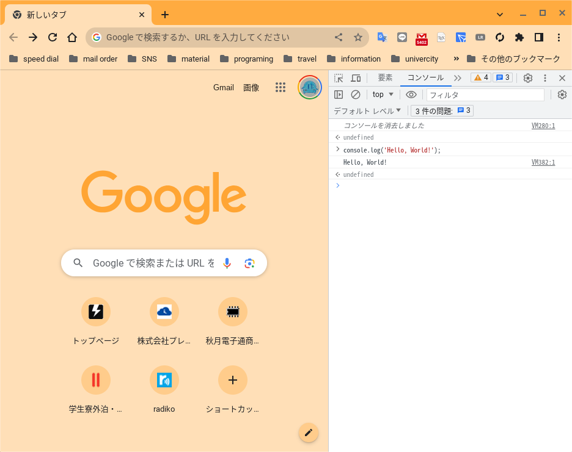

# JavaScriptを始めよう

> 想定時間: 90分
> 動作環境: Google Chrome

<details>
  <summary>TOC</summary>

  1. JavaScript に触れてみよう
     1. ブラウザの開発者ツールを見よう
     2. Hello, World! しよう
     3. 読みやすいコードを書くために
        1. 厳格モード
        2. コメント
        3. 命名
        4. インデント
  2. JavaScript で計算させよう
     1. 四則演算
     2. その他の算術演算
     3. 計算をひとまとめにする
  3. 条件によって処理を変えよう
     1. if文
     2. 三項演算子
  4. 繰り返し処理をさせよう
     1. for文
     2. `Array.prototype.forEach()`
  5. 非同期処理を使おう
     1. `Promise`/`then()`
     2. `async`/`await`
  6. ブラウザの標準APIを使ってみよう
     1. ファイルAPI
     2. 位置情報API
  7. コードをまとめてわかりやすくしよう
     1. 関数
     2. オブジェクト
     3. クラス

</details>

## 1. JavaScript に触れてみよう

JavaScript(以下JS)とは一般にWeb開発やシステム開発に用いられるプログラミング言語の一つです。
今回はインターンでのチーム開発にあたって基礎的なJSについて説明します。
> **※注意** 本記事には一部説明の簡単のために厳密には正しくない表現・説明があります。なるべく正確な記述を行いますが、気になる箇所は参考文献にある記事などから調べて貰えればと思います。

### 1-1. ブラウザの開発者ツールを見よう

Chromeではウィンドウ右上のケバブボタンから開いたメニューの「その他のツール」から「デベロッパーツール」を開けます。

ショートカットキーが設定されているため、WindowsやChromeOSでは `Ctrl`+`Shift`+`I` で、macOSでは `Cmd`+`Option`+`I` でも開くことができます。また、ページの適当な部分で右クリックして「検証」を押すことでも開発者ツールが開けます。
無事にツールが開けていれば以下のような表示になるはずです。

開いているタブが要素タブ(Elementタブ)ではなかったり日本語化されてなかったり日本語化案内が出るかもしれませんが、ひとまずコンソールタブ(Consoleタブ)を開いてください。これで準備完了です。


### 1-2. Hello, World! しよう

「新たにプログラミング言語の学習を始めるとき、まず`Hello, World!`から始める教」に入信しているため、まずは標準的な出力方法で「Hello, World!」を表示させることにします。
先程開いたコンソールタブに以下のコードを入力してみてください。

```JavaScript
console.log('Hello, World!');
```

実行すると以下の画像のように表示されるはずです。

このように、JSでは `Console.log(<任意の文字列>);` とすることでコンソールタブに出力を出すことができます。

### 1-3. 読みやすいコードを書くために

これから始まるインターンやその他でも「チーム開発」をしなければならないタイミングがあると思います。
そんなとき最も大事なことの一つが「**コードを読んだ人間に処理の意味・意図が伝わること**」です。
自分以外の人が見ても読みやすいコードを書くために、JSの機能やプログラムを書く上で気をつける点を説明します。

#### 1-3-1. 厳格モード

厳格モード (strictモード) とは、そうでない状態ではエラーにはならない微妙な実装をエラー扱いとするモードです。これによって、暗黙的に失敗していた処理をエラーとして検知できるようになったり、JSのエンジンが最適化しづらい手順を修正できるようになったりといったメリットがあります。しかし、利用したい構文がstrictモードに非対応である場合には注意が必要です。

厳格モードはJSのコード内に`"use strict";`と記述することで有効化できます。
試しに以下のコードを実行してみてください。

```JavaScript
"use strict";
a = 1;
```


↑の画像のようにエラーが出れば問題なく厳格モードが有効になっています。この場合は未宣言の変数を操作しようとしたことでエラーが発生しています。
これは意図せずグローバル変数を宣言してしまうことを防いでくれます。

このように便利な厳格モードですが、スクリプト全体で有効にしてしまうと他のライブラリやファイルが厳格モードに対応しない記述で書かれていたときに動作しなくなってしまうことには注意が必要です。
使用方法のおすすめとしては関数の冒頭部で有効化するものです。そうすることで厳格モードは関数内でのみ有効になります。

#### 1-3-2. コメント

コメントは他のほぼすべてのプログラミング言語にもある「コード中に記述されているが処理に影響がない文」のことで、JSでは以下の二通りで記述できます。

```javascript
console.log('コメントの説明');
// console.log('これは一行だけをコメントにするやつ');
console.log('//が書いてある行にしか影響しない');

/**
 * console.log('これは複数行をコメントにするやつ');
 * console.log('/* から * /までの間が実行されない');
 */
```

コメントを適切に書くことでコードの意図や内容を他の開発者にわかりやすく伝えることができます。
また、実行したくないコードをコメントにすることで開発中のデバッグをやりやすくする使い方もあります。

#### 1-3-3. 命名

命名はプログラムを書く上で逃れられず、かつ難しい要素の一つです。
「名は体を表す」ということわざがありますが、意識するべきはまさにこれです。
コードを読む上でわざわざ他人の書いたコードをすべて読んで意味を理解してから使うことはあまりにも面倒です。そのため、完結で処理の内容や意味、効果がわかりやすい命名を変数・関数にするべきだとされています。

| 良い例 | 悪い例 |
| ---- | ---- |
| `let count = 0;` | `let a = 0;` |
| `function solveQuadraticEquation () {...}` | `function solve() {...}` |

1つ目の例はあまりにも極端ですが、`count`という名前で宣言されている方が変数の利用目的が明確です。
2つ目の例は場合によってどちらがいいかの判断が変わる場合があります。特にクラスのメンバとしてある式を解くような関数の場合では悪い例は悪いとは言い切れません。また、エディタの補完機能がない場合には冗長な命名の関数は嫌われるため良い例が必ずしも良いわけではありません。

時と場合に合わせて命名とコメントを組み合わせて誰が読んでもわかりやすいコードになるよう心がけましょう。

#### 1-3-4. インデント

インデントとは、行頭の字下げのことを指します。
主にコード中のブロックをわかりやすくするために利用されます。Pythonのようなインデントベースの言語ではブロックそのものを表すために使われますが、JSではコードのブロックは`{}`で表現されるため、インデントがなくてもエラーになったりはしません。
基本的にインデントをつけたほうが処理の塊がわかりやすくなるので、なるべくつけるようにしましょう。なお、`{}`で囲まれた文をそれまでの字下げよりもう1段階深くインデントするのが一般的です。

インデントなし

```javascript
function myFunc () {
let i = 0;
for (i = 0; i < 10; i++) {
console.log(i);
}
}
```

インデントあり

```javascript
function myFunc () {
  let i = 0;
  for (i = 0; i < 10; i++) {
    console.log(i);
  }
}
```

## JavaScript で計算させよう

## ブラウザの標準APIを使ってみよう

## 参考文献

- mdn web docs: <https://developer.mozilla.org/ja/docs/Web/JavaScript>
- JSPrimer: <https://jsprimer.net/>
- ECMAScript2020言語仕様　私的日本語訳: <https://xn--ecmascript2020-tt9vf572amitfjlc.com/>
