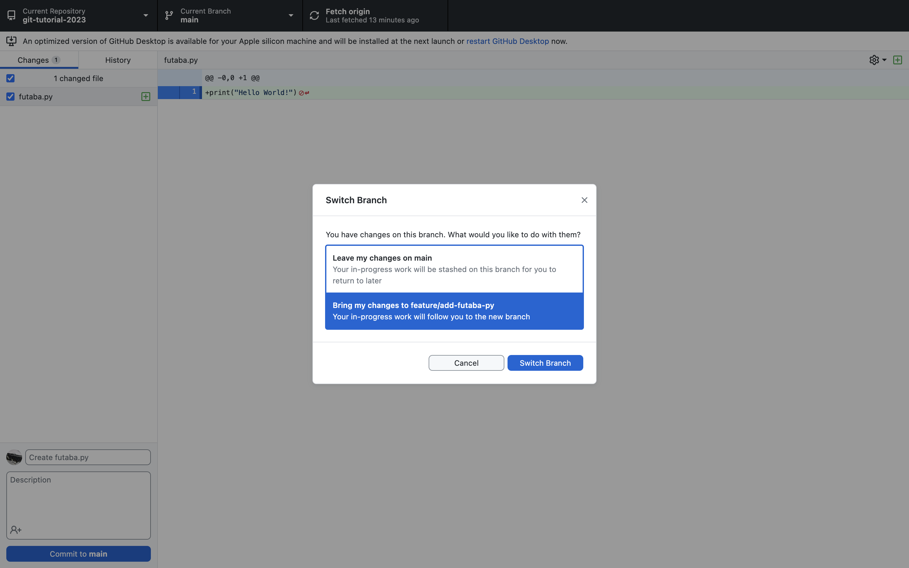
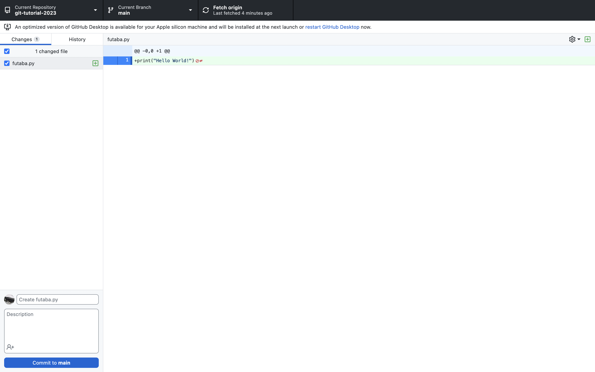
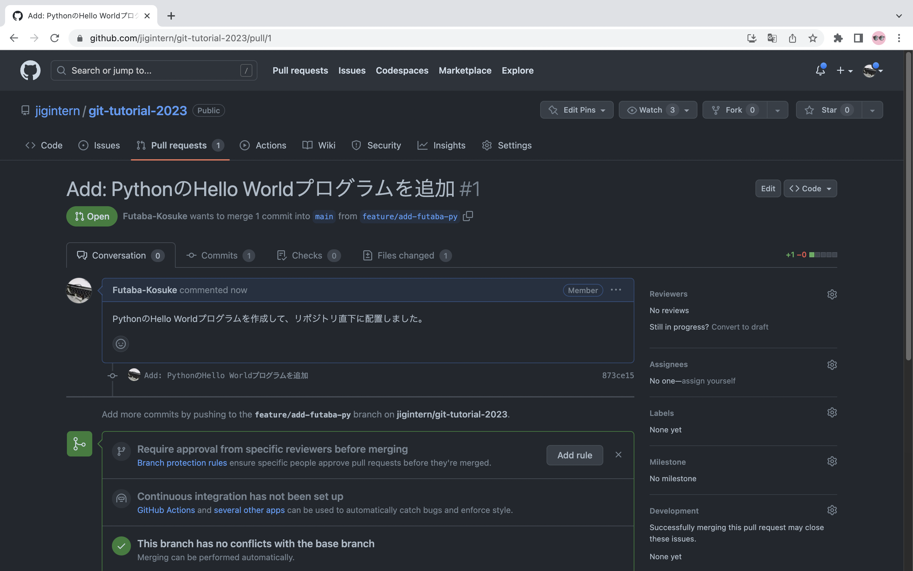
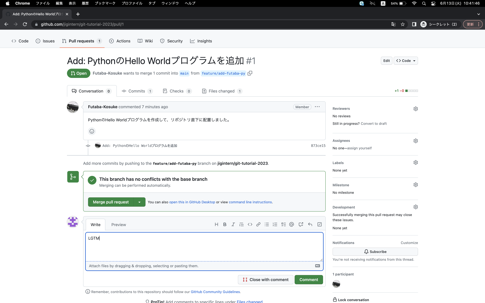
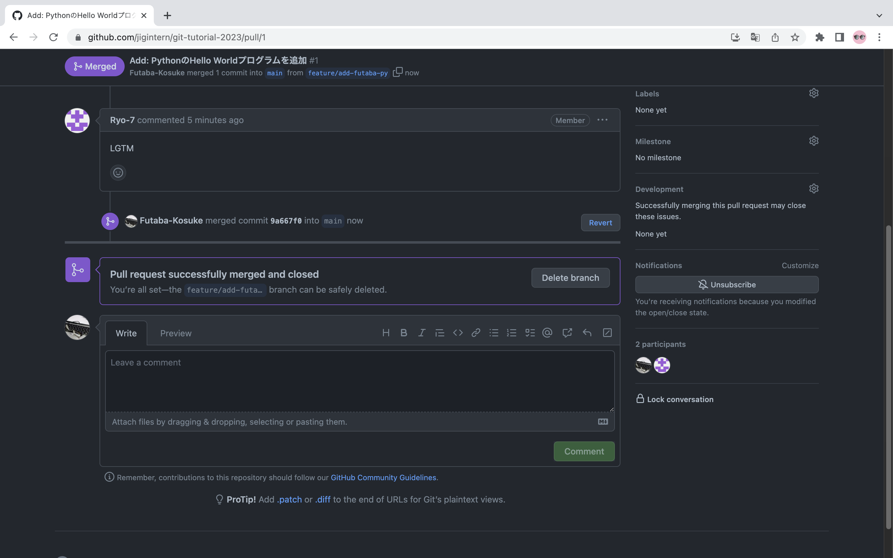

# **Github Desktop** を
# 利用したチーム開発手法

---

## 1. 導入編

*Git・Github・Github Desktop
について知ろう！*

---
<!--
header: 1-1. Gitとは何か？
-->

## 1-1. Gitとは何か？

---

### Gitとは何か？

> Git（ギット）は、プログラムのソースコードなどの変更履歴を記録・追跡するための分散型バージョン管理システムである。  
> 出典: https://ja.wikipedia.org/wiki/Git

---

### 分散型……バージョン管理システム……？

---

### **ゲームのセーブデータ**みたいに
### 今の状態を保存しておくもの

これをリポジトリ、と呼びます

---

### **作業が一段落**したら、今の状態を保存します

履歴が溜まっていきますね
すると……？

---

### **いつ、何の機能**を実装したのか分かる

履歴には説明文をつけるので、
分かりやすいです

---

### バグが発生した時も、**元に戻せる**

過去のデータに、一瞬で元通り

---

### 変なデータ、**必要なし**

- `program.c`
- `program(1).c`
- `program(2).c`
- `program(3)_これが最終版.c`
- `program_提出用.c`

---

### その上、**複数人**で作業するための機能も沢山

編集の重複を防いだり、差分を分かりやすくしたり……

---

### Gitとは何か？

ソースコードをいい感じに管理するやつ

---

<!--
header: 1-2. Githubとは何か？
-->

## 1-2. Githubとは何か？

---

### Githubとは何か？

> GitHub（ギットハブ）は、ソフトウェア開発のプラットフォームであり、ソースコードをホスティングする。コードのバージョン管理システムにはGitを使用する。  
> 出典: https://ja.wikipedia.org/wiki/GitHub

---

### ソースコードを……ホスティングする……？

---

### つまり？

---

### Gitをオンラインで管理するやつ

Gitのデータをアップロードして共有・バックアップするためのサービスです

[https://github.com/](https://github.com/)

---

### 記録がある程度溜まったら、**アップロード**

PC上のデータが吹っ飛んでも、オンラインに残ります

---

### 複数人で、データ**共有**

クラウドでの共有は不要です

---

### **他の人**も、閲覧可能

共同開発の場としても、能力をアピールする場としても

---

### Githubとは何か？

ソースコードをいい感じに、チームで管理するやつ

---

<!--
header: 1-3. Github Desktopとは何か？
-->

## 1-3. Github Desktopとは何か？

---

### Github Desktopとは何か？

> GitHub Desktop では、コマンド ラインや Web ブラウザーではなく GUI を使用して GitHub と対話できます。  
> 出典: https://docs.github.com/ja/desktop

---

### Gitは、**コマンドライン**で操作するのが一般的

→

---

### Github Desktopを使えば、**コマンド無し**で操作できます

環境構築もインストールするだけ！
事前にインストールして貰いました

---
<!--
backgroundColor: #222
color: #FFF
-->

### UIはこんな感じ
表示されているのは、この資料を書いている時の様子です

---
<!-- 
_header: ""
-->

---
<!--
backgroundColor: #default
color: #default
-->

### 今回はGithub Desktopを使って開発します
お気に入りのGitの操作方法があれば、そちらで進めていただいても問題ありません！

---
<!-- 
_header: ""
backgroundColor: #222
color: #FFF
-->

## 2. Github Desktopを触ってみよう

*Github Desktopを実際に使ってみよう！*

---
<!-- 
header: 2-1. clone: Githubリポジトリを丸ごとダウンロードしよう
-->

### 2-1. clone: Githubリポジトリを丸ごとダウンロードしよう

---

### Githubからリポジトリをダウンロードしてみましょう
これをclone（クローン）と呼びます

---

### 今回はこちらで事前にリポジトリを作成しました

---

### ブラウザで以下URLを開いてください
Zoomのチャット欄にも記載します

[https://github.com/jigintern/git-tutorial-2023](https://github.com/jigintern/git-tutorial-2023)

---

###### 　1. 「<> Code」のボタンをクリックします

---

###### 2. 表示されたウィンドウの「Open with Github Desktop」をクリックして、Github Desktopを開きます

---

###### 　3. 「Local Path」にPC上での保存先を設定し、「Clone」をクリックします

---
###### 　4. リポジトリがクローンできたことを確認します

---
###### 　5. 「Open in Visual Studio Code」をクリックして、リポジトリをVisual Studio Codeで開きます

---

### Visual Studio Codeが開きます

何か他のエディタを使用している場合はそちらで開くかも

---
<!-- 
_header: ""
-->

---

### ダウンロードできてそうですね

---
<!-- 
header: 2-2. branch: 作業を枝分かれさせよう
-->

### 2-2. branch: 作業を枝分かれさせよう

---

### 作業を枝分かれさせてみましょう
これをbranch（ブランチ）と呼びます

---

### クラウドサービスで**ファイル共有**すると……
編集が重複したりして、片方の編集内容が消されることも

---

###### 枝分かれすると、複数人で同じファイルを触っても（ちょっと）安心です

---

### では、ブランチを切ってみましょう
ブランチを作ることを、慣習的に「ブランチを切る」、といいます

---

###### 1. ブランチ操作用のフォームを開きます

---

###### 2. 「New Branch」をクリックして、新規ブランチの作成ウィンドウを開きます

---

###### 3. 新規ブランチの名前を入力して、「Create Branch」をクリックします。ブランチ名の重複が発生しないように注意してください

---

###### ex. 既にブランチに変更を加えている場合は、以下のような画面が表示されるので、「Bring my changes to ...」を選択してください

---

###### 4. 新しいブランチができるので、作業に取り掛かることができます。

---
<!-- 
header: 2-3. commit: 作業前と後の**差分を記録**しよう
-->

### 2-3. commit: 作業前と後の**差分を記録**しよう

---

### 作業前と後の**差分を記録**してみましょう
これをcommit（コミット）と呼びます

---

### Gitはファイルの**現在の内容を保存**することを繰り返してログを作ると言いましたが……
実は、全てを保存するわけではありません

---

### 作業を重ねる程に**データが膨大**になってしまいます
これでは、いけませんね。しかし、解決する方法があります

---

###### データの保存時には、作業前と後の**差分を記録**する

---

### では、コミットしてみましょう

---

###### 1. Visual Studio Codeを開いて、ファイルを新規作成します。ファイル名が重複しないよう、自分の名前などを半角英字でつけてください

---

###### 2. 作成したファイルに、適当なプログラムを書き込みます

---

###### 3. Github Desktopを開いて、差分が表示されていること、その差分が正しいことを確認します

---

###### 4. 画面左下のフォームから、変更内容についての説明文（コミットメッセージ）を記載します

---

###### 5. 「Commit to ...」をクリックします。これで完了です

---
<!-- 
header: 2-4. log: 作業の履歴を確認しよう
-->

### 2-4. log: 作業の履歴を確認しよう

---

### 作業の履歴を確認してみましょう
この履歴をlog（ログ）と呼びます

---

###### 「History」をクリックして、コミットの履歴が表示されることを確認します

---

### よさそうですね

---
<!-- 
header: 2-5. push: 作業の成果をGithubにアップロードして共有しよう
-->

### 2-5. push: 作業の成果をGithubにアップロードして共有しよう

---

### 作業の成果をGithubにアップロードしてみましょう
これをpush（プッシュ）と呼びます

---

早速、プッシュしてみましょう

---

###### 1. 「Changes」をクリックして、元の画面に戻ります

---

###### 2. 「Publish branch」をクリックして、変更内容をプッシュします

---

###### 3. ブラウザでGithubを開き、プッシュしたブランチが正しく反映されていることを確認します

---

<!-- 
header: 2-6. Pull Request: 枝分かれした成果を結合しよう
-->

### 2-6. Pull Request: 枝分かれした成果を結合しよう

---

### ブランチ機能で枝分かれさせた作業を結合させましょう
これをmerge（マージ）と呼びます

---

### 一応、手元でマージもできますが……
マージする時は、バグ等の防止のため、他の人に確認して貰いたいです

---

### GithubのPull Request（プルリクエスト）機能を使いましょう！

---

### プルリクエストでマージしましょう

---

###### 1. Githubで「Pull requests」のタブをクリック

---

###### 2. 「New pull request」をクリックします

---

###### 3. 新規ブランチの名前、Pull Requestのタイトル、本文を入力します。作業内容が理解しやすい内容にすると良いです

---

###### 4. 「Create pull request」をクリックすると、Pull Requestが作成されます

---

### 5. 他開発者に、Pull Requestの確認を依頼します  
SlackやGithub上でのコメントなど、適宜チーム内で決定した方法で依頼しましょう

---

###### 6-1. 確認を依頼された人は、Pull Requestの変更内容等を確認して、問題箇所があればコメント等で指摘します  

---

###### 6-2. 問題箇所が無い場合は、LGTM（Looks Good To Me: 私は良いと思います）等のコメントをつけて確認したことを報告しましょう

---

###### 7. Pull Requestの作成者は、「Merge pull request」をクリックして、Pull Requestを元のブランチに結合します

---

###### 7. Pull Requestの作成者は、「Merge pull request」をクリックして、Pull Requestを元のブランチに結合します

---

##### 8. mainブランチを確認して、変更内容が正しく取り込まれていることを確認します
Githubで開いてみましょう

---

<!-- 
header: 2-7. fetch / pull: Githubリポジトリの変更部分をダウンロードしよう
-->

### 2-7. fetch / pull: Githubリポジトリの変更部分をダウンロードしよう

---

### Githubの更新を、PC上に取り込みましょう
これをfetch（フェッチ） / pull（プル）と呼びます

---

fetch（フェッチ）は、Github上のリモートリポジトリの**変更を確認**する操作です。  
pull（プル）は、Github上のリモートリポジトリの**変更をダウンロード**する操作です。

---

1. fetchしてGithubの変更を確認して
2. pullしてその変更を取り込む

---

### というイメージになります

---

### 実際に取り込んでみましょう

---

###### 1. mainブランチに移動します

---

###### 2-1. 画面上部の「Fetch origin」をクリックします  

---

###### 2-2. これだけでは変更内容は取り込まれませんが、Github上で変更があったことをGithub Desktopが認識します  

---

###### 2-3. （Github Desktopの自動更新がONになっている場合、既に変更が取り込まれている場合があります）

---

###### 3. 画面上部の「Pull origin」をクリックします  

---

###### 4. 変更内容が取り込まれていることを、「History」から確認します

---
<!-- 
header: ""
-->

## 3. まとめ
*できるようになったことを、振り返ろう*

---

1. clone: Githubリポジトリを丸ごと丸ごとダウンロードする
2. branch: 作業を枝分かれさせて、他の開発者との衝突を防止する
3. 通常通りに、プログラムを書く
4. commit: 作業前と後の**差分を記録**しよう
5. push: 作業の成果をGithubにアップロードして共有する
6. Pull Request: 枝分かれした成果を結合する
7. review: 他の開発者の作業内容を確認する

---

### これでGit入門は完璧です
お疲れ様でした！

