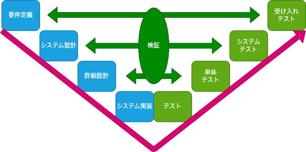
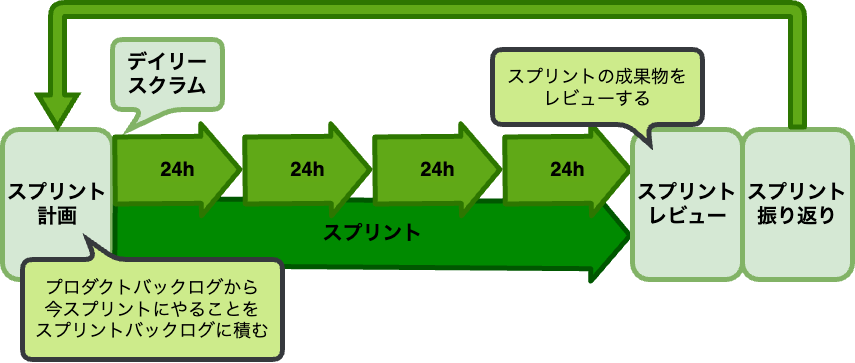

# 開発プロセス概要 (5min) 

ソフトウェア開発プロセスは、成功するプロジェクトの基盤となる重要な要素です。
効率的で体系的な開発プロセスは、プロジェクトの品質向上、リスクの軽減、コストの削減、そしてスケジュールの遵守に大きく貢献します。
代表的な3つの開発プロセスの概要とその特徴について紹介します。
今回のインターンではアジャイル型で開発します。

- ウォーターフォール型開発
- プロトタイプ型開発
- アジャイル型開発

## ウォーターフォール型開発

ウォーターフォール型開発は、開発プロセスを一連の段階に分けて順次進める方法です。
名前の由来は、各工程が滝のように次の工程へと流れていくことからです。大規模で安定した要件が確定しているプロジェクトに適しています。
デメリットとして、柔軟性が低く、変更に対応しにくい特徴があります。
主な工程を以下に示します。

1. **要件定義**：
何を開発するかを明確にする。ユーザーのニーズやシステムの要件を収集し、ドキュメント化する。

1. **システム設計**：
要件定義に基づいてシステムの全体を設計する。アーキテクチャ設計やデータベース設計、インタフェース設計などを行う。

1. **詳細設計**：
システム設計を基に、各コンポーネントやモジュールの詳細を設計する。プログラムの構造やフローを詳細に設計する。

1. **実装**：
詳細設計に基づいてコーディングを行う。各モジュールを実際にプログラムとして実装する。

1. **テスト**：
実装したプログラムをテストし、要件通りに動作することを確認する。ユニットテスト、システムテスト、受け入れテストなどが含まれる。

1. **導入**：
テストが完了したシステムを本番環境に導入する。ユーザーにシステムを提供し、運用を開始する。

1. **運用と保守**：
システムを運用し、必要に応じて保守する。問題やバグが発生した場合は修正し、システムの改善を図る。

## プロトタイプ型開発

プロトタイプ型開発は、製品やシステムの初期モデル（プロトタイプ）を迅速に作成し、ユーザーやステークホルダー[^1]からのフィードバックを基に改善を反復する開発手法です。
原則としてプロトタイプ作成サイクルと製品版作成サイクルの2つで構成されています。
後述のアジャイル型開発では、繰り返すサイクルの中で仕様や機能が決定していくのに対し、プロトタイプ型開発はプロトタイプを作成する上で、仕様や要件がある程度決定している必要があります。
アジャイル型開発ほどフィードバックを反映する自由度はないため、時間とコストの管理が重要であり、過度なスコープ[^2]拡大を防ぐための適切なマネジメントが求められます。
主な工程を以下に示します。

1. **要件収集**：
ユーザーやステークホルダーのニーズや要求を収集し、初期の要件を定義する。この段階では、詳細な仕様よりも全体的なニーズや問題点に焦点を当てる。

1. **プロトタイプの設計**：
要件に基づいて、初期プロトタイプの設計をする。デザインスケッチやワイヤーフレームなどを使って、システムの大まかな構造を示す。

1. **プロトタイプの開発**：
初期の簡単なモデルを作成する。この段階では、実装が難しい部分は省略してもよいので、ユーザーインタフェースや基本的な機能を重視する。

1. **ユーザーテストとフィードバック収集**：
ユーザーにプロトタイプを実際に使用してもらい、フィードバックを収集する。フィードバックを基に、プロトタイプの改善点を洗い出す。

1. **改善と改良**：
フィードバックに基づいてプロトタイプを改良する。フィードバックを基にプロトタイプを最終製品に近づける。

1. **製品の完成**：
ユーザーの要求を満たす最終プロトタイプが完成後、最終プロトタイプを基に正式な製品やシステムの開発に移行します。

## アジャイル型開発

アジャイル開発は、柔軟性、迅速な対応、ユーザーのニーズへの応答を重視した開発手法です。
特徴として、プロジェクト全体をスプリントと呼ばれる複数の小さな開発サイクルに分割し、各スプリントで部分的な製品を開発していきます。
先述のウォーターフォール型・プロトタイプ型とは対照的に、継続的な開発・リリースによるアプローチが特徴です。
柔軟に機能を追加したりユーザーやステークホルダーからのフィードバックを迅速に反映したりできる反面、マネジメントが複雑になりコストの算出が難しくなったり、最初から厳密に方針を定めないことも多いので開発途中で構想のブレなども生じやすいです。
詳細な工程については、後述のスクラム開発で説明します。

Tips. 4つの基本価値と12の原則

> アジャイル開発は、2001年に発表された「アジャイルソフトウェア開発宣言[^3]」に掲げられている以下の4つの基本価値と12の原則に基づいています。
> - 基本価値
> 1. 個人と対話をプロセスとツールよりも重視する。
> 1. 動くソフトウェアを包括的なドキュメントよりも重視する。
> 1. 顧客との協調を契約交渉よりも重視する。
> 1. 変化への対応を計画に従うことよりも重視する。
> - 12の原則
> 1. 顧客満足を最優先し、価値のあるソフトウェアを早期かつ継続的に提供する。
> 1. 要求の変更を歓迎し、たとえ開発の後半であっても対応する。
> 1. 短い時間間隔で動くソフトウェアを頻繁に提供する。
> 1. 開発者とビジネス側の人々が日々協力する。
> 1. プロジェクトを動機づけられた個人で構成し、必要な支援と信頼を提供する。
> 1. 対面でのコミュニケーションが最も効率的かつ効果的である。
> 1. 動くソフトウェアが進捗の最も重要な指標である。
> 1. 持続可能な開発ペースを維持する。
> 1. 技術的卓越性と良い設計に対する継続的な関心が敏捷性を高める。
> 1. シンプルさ（やらないことの最大化）が重要である。
> 1. 自己組織化チームが最良のアーキテクチャ、要求、設計を生み出す。
> 1. 定期的にチームがどのように効率を高めるかを振り返り、行動を調整する。

# スクラム開発 (10min)

スクラム開発は、アジャイル型開発の1つで、チームが効率的に作業を進め、継続的に価値を提供するためのフレームワークです。
スクラムは、自己組織化された技術横断的なチームが短期間のスプリントと呼ばれる開発サイクルを通じて、機能を段階的に開発していくフレームワークです。

## スクラム開発での役割

スクラム開発では、円滑に開発を進めるためにそれぞれが重要な役割を担当します。
以下に、各役割について説明します。

- ### プロダクトオーナー
    - プロダクトのビジョンと目標を保持し、プロダクトバックログを管理する責任を持つ
    - 顧客やステークホルダーのフィードバックを反映し、バックログアイテムの優先順位を設定する
- ### スクラムマスター
    - チームがスクラムのルールを理解し、適用するのを支援する
    - チームの障害を取り除き、スプリントの円滑な進行をサポートする
- ### 開発チーム
    - プロダクトのインクリメント(成果物)を作成する
    - 技術横断的なメンバーで構成される
    - 設計、開発、テストなどの全工程を担当する

## 用語

スクラム開発を進行するために、知っておくべき概念や用語を説明します。
以下に、各用語について説明します。

- ### ビジョン
    - プロダクトがどんなものなのかを示し、プロダクトの開発指針となるもの
        - ターゲット、ニーズ、強み、ユーザーが使う理由、主要な競合、差別化ポイントなど
    - スクラムチーム全員が唱えられるくらいを目標に
- ### プロダクトバックログ
    - プロダクトに必要な全ての機能や要件をリスト化したもの
    - プロダクトオーナーが管理し、優先順位をつける
- ### スプリント
    - 1〜4週間の固定期間で、プロダクトの成果物を作成するための開発サイクル
    - 計画、実装、レビュー、振り返りで構成される(後述)
- ### スプリントバックログ
    - そのスプリントで実装する予定のプロダクトバックログ項目と、その実現のための具体的なタスクのリスト
    - 開発チームが作成し管理する

## 会議体

スクラム開発を進める上で、重要な会議が4つあります。
以下に、各会議について説明します。

- ### スプリント計画
    - スプリントの開始時に行うミーティング
    - 開発チームがスプリントで何を達成するかを決定しスプリントバックログを作成する
- ### デイリースクラム
    - 毎日行う15分のミーティング
    - 開発チームが進捗を確認し、障害を共有し、次の24時間の作業を計画する
- ### スプリントレビュー
    - スプリントの終了時に行うミーティング
    - チームが成果物をデモンストレーションし、ステークホルダーからフィードバックを受け取る
- ### スプリント振り返り
    - スプリントの終了後に行う振り返りミーティング
    - チームがプロセスを評価し、改善点を見つけるために行う

## スプリントの流れ

ここまでの話をまとめると1スプリントあたりの流れは以下の図のようになります
このようなスプリントを繰り返し、段階的に開発を進めていきます

# スクラム開発演習(30~45min)

プロダクトを仮想して、実際の流れを体験してみましょう。
勉強会向けにアレンジしているので、プロダクトオーナーとスクラムマスターは開発チーム兼任します。
大まかな流れは以下の通りです。

1.  アイデア出し
1.  ビジョンの決定
1.  担当の割り振り
1.  プロダクトバックログの登録
1.  スプリント計画
1.  作業(4日)
1.  スプリントレビュー
1.  スプリント振り返り
1.  次スプリント計画
1.  6.に戻ってくり返す

作業については以下のルールを設けます。

- スプリントは第3スプリントまでとする
- 1スプリントは4日とする
- 1日の作業はサイコロを1回振り、出目の数を進捗とする
    - サイコロがない場合は、Googleで"1d6"と検索
- それぞれのタスクは一律で出目の合計が12で完了とする
- 1チーム3~5人を目安とする

## 1. ビジョンの決定

今回は、仮に「地域向け防災アプリ」をテーマにします。

## 2. 担当の割り振り

話し合って以下の担当を決定してください。
- プロダクトオーナー(1人)
    - 開発チームと兼任 
- スクラムマスター(1人)
    - 開発チームと兼任
- 開発チーム(各1人以上)
    - サーバ
    - クライアント
    - デザイン

## 3. プロダクトバックログの作成

アプリのビジョンからどのような機能を実装するか洗い出し、プロダクトバックログに登録します。
このリストはプロダクトオーナーがHackMDなどのマークダウンで作成し、管理してください。
作成したプロダクトバックログに以下の内容を箇条書きでいいので記載してください。

- 環境構築
- ログインの実装
- 通知の実装
- ホーム画面の実装
- 地図画面の実装

## 4. スプリント計画

プロダクトバックログから、今スプリントやることを整理してスプリントバックログを作成する。
プロダクトバックログの項目からタスクを洗い出し、タスクを開発チームで担当を割り振る。
前スプリントで追加されたプロダクトバックログについても、タスクの洗い出しをしてください。
残りのスプリントをみて、ビジョンを実現するために優先して実装するタスクを考えてください。

- 環境構築： Aさん
- 通知の実装　
    - DB設計： Aさん
    - API実装： Bさん
- ホームの実装
    - API実装： Bさん
    - デザイン： Cさん
    - クライアント実装： Cさん
- ログインの実装　
    - DB設計：
    - API実装：
- 地図の実装
    - API実装：
    - デザイン：
    - クライアント実装：

## 6. デイリースクラムと作業(4日)

以下の手順で作業します。

1. 自分がその日担当するタスクをチーム内で共有してください
1. その後、実施するタスクについてサイコロを振って出目を手元に記録してください
1. 手元の合計が12以上ならタスクを完了とします
1. もし手持ちタスクがなくなったのであれば、着手されていないタスクの担当を自分に割り振ってください

## 6. スプリントレビュー

以下のような指摘があったと想定して、プロダクトバックログに次の登録してください。
第2スプリント以降も適宜指摘を追加してください。

指摘例
- 通知の処理が遅い
- ホーム画面の表示が崩れている

## 7. スプリント振り返り

KPTで振り返りをします。まず良かったこと、改善点を挙げて、その後改善点に対してどう改善するか改善方法を検討します。
Tryに書かれたものは次スプリントで実際に改善を試みます。
この演習ではスクラムマスターがサイコロを振り偶数の目なら業務改善成功したとします。
業務改善成功した場合、次スプリントで１人だけサイコロを2つ振れるようになります。
振り返りが終了したら、スプリント計画をして次スプリントを開始してください。

KPT例
- よかったこと(Keep)
    - Aさんが環境構築やってくれた
    - BさんAPI実装感謝
- 改善点(Problem)
    - Cさんの出目が悪い 
- 改善方法(Try)
    - Cさんのサイコロを増やす

## プロダクトのゴール

全てのスプリントが完了して、どのような機能が実装できて、何ができなかったか全体をKPT振り返ります。
反省を次はインターンでは活かしてみましょう。

[^1]: 株主・経営者・従業員・顧客・取引先のほか、金融機関、行政機関、各種団体など、企業のあらゆる利害関係者。

[^2]: プロトタイプの作成および評価に含まれる機能や要件の範囲。

[^3]: アジャイルソフトウェア開発宣言(https://agilemanifesto.org/iso/ja/manifesto.html)

